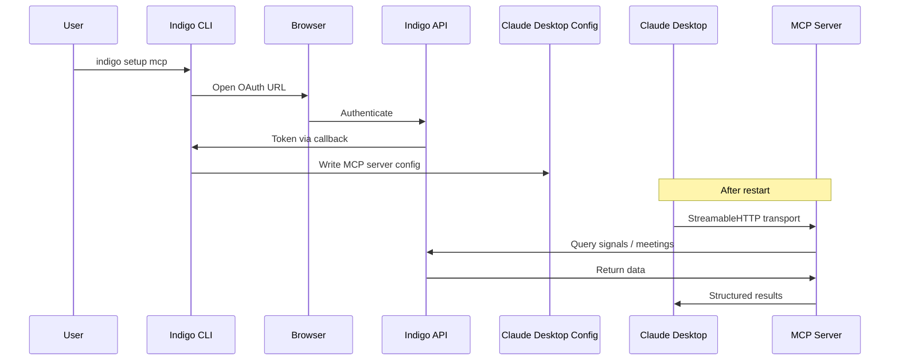

import { Tabs, TabItem, Aside, Steps } from "@astrojs/starlight/components";

The `setup mcp` command configures [Claude Desktop](https://claude.ai/download) to access your Indigo data through the Model Context Protocol (MCP). After setup, you can query your signals, meetings, and decisions directly from Claude.

## Setup

```bash
indigo setup mcp
```

This command:

<Steps>

1. Triggers an OAuth flow to authenticate with Indigo
2. Generates an MCP server configuration
3. Writes the configuration to the Claude Desktop config file
4. Validates the connection

</Steps>

<Aside type="note">
Requires Indigo CLI v0.2 or later. Run `indigo --version` to check.
</Aside>



## Config file location

The command writes to the Claude Desktop configuration file at the appropriate path for your platform:

<Tabs>
  <TabItem label="macOS">
    ```
    ~/Library/Application Support/Claude/claude_desktop_config.json
    ```
  </TabItem>
  <TabItem label="Windows">
    ```
    %APPDATA%\Claude\claude_desktop_config.json
    ```
  </TabItem>
  <TabItem label="Linux">
    ```
    ~/.config/Claude/claude_desktop_config.json
    ```
  </TabItem>
</Tabs>

## Transport

The MCP server uses **StreamableHTTP** transport for reliable, persistent connections between Claude Desktop and the Indigo API. This handles reconnection and message delivery automatically.

## What it enables

Once configured, Claude Desktop can:

| Capability | Example prompt in Claude |
|------------|--------------------------|
| Query signals | "What decisions were made this week?" |
| Search meetings | "Find my meetings with the engineering team" |
| Review action items | "What action items are assigned to me?" |
| Cross-reference | "What was decided about pricing in last Tuesday's meeting?" |

Your signals, meetings, and decisions become part of Claude's context, queryable through natural language.

## Verify the setup

After running `indigo setup mcp`, restart Claude Desktop and try a query:

```
What signals do I have from this week?
```

If Claude returns your signal data, the MCP connection is working.

<Aside type="caution">
If Claude cannot access your data, verify that you are authenticated (`indigo auth status`) and that Claude Desktop has been restarted after configuration.
</Aside>

## Learn more

For detailed documentation on the MCP server's data model, available tools, query patterns, and use cases, see the [MCP Server](/mcp/overview/) section.
