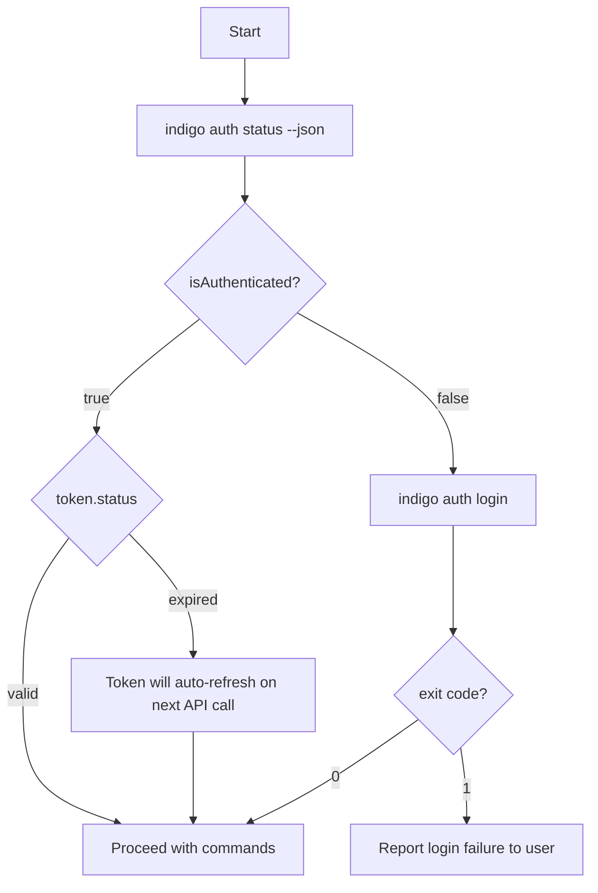
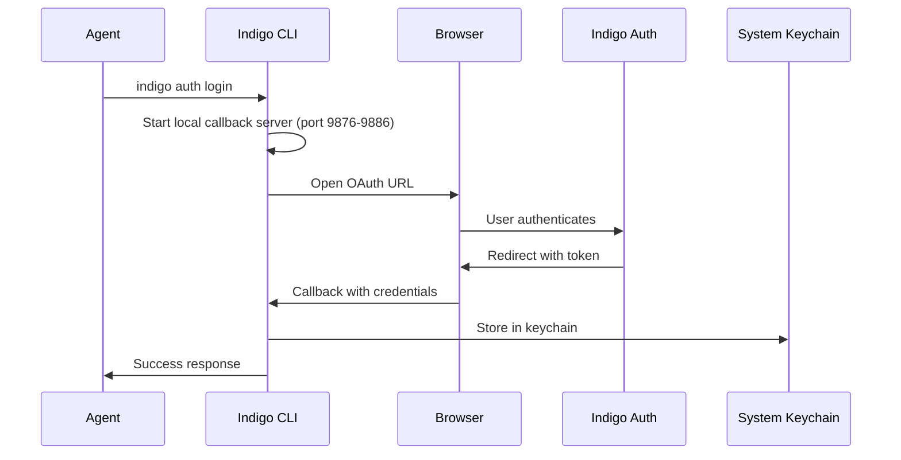

import { Aside, Tabs, TabItem } from "@astrojs/starlight/components";

Authentication is the first step in any CLI session. Before an agent can query signals, browse meetings, or configure settings, it must ensure the user is authenticated. This skill page documents every authentication command, its flags, expected outputs, exit codes, and error scenarios.

## Quick reference

| Command | Purpose | Exit 0 means |
|---------|---------|--------------|
| `indigo auth status --json` | Check current auth state | Authenticated (check `isAuthenticated` field) |
| `indigo auth login` | Authenticate via browser OAuth | Login successful |
| `indigo auth login --force` | Force CLI-specific login (bypass Electron credentials) | Login successful |
| `indigo auth logout` | Remove stored credentials | Logout successful |
| `indigo account create` | Create new account via browser | Account created and authenticated |
| `indigo account info --json` | View account details | Account info retrieved |

## Agent workflow

Every agent session should begin with an authentication check. This is the recommended decision flow:



<Aside type="tip">
Always use `--json` when checking auth status programmatically. The JSON output gives you structured fields (`isAuthenticated`, `token.status`, `credentialSource`) that are reliable to parse. Human-readable output is for display only.
</Aside>

### Recommended agent script

```bash
# Step 1: Check if authenticated
STATUS=$(indigo auth status --json 2>/dev/null)
IS_AUTH=$(echo "$STATUS" | jq -r '.data.isAuthenticated')

if [ "$IS_AUTH" != "true" ]; then
  # Step 2: Login if needed
  indigo auth login --json
  if [ $? -ne 0 ]; then
    echo "Authentication failed. Cannot proceed."
    exit 2
  fi
fi

# Step 3: Proceed with work
indigo signals list --json
```

## Commands

### `indigo auth status`

Check the current authentication state. This is the primary command agents should call before any other operation.

**Flags:**

| Flag | Description |
|------|-------------|
| `--json` | Output as JSON for scripting |

**Human-readable output (authenticated):**

```
Authentication Status
----------------------------------------
Status:  Logged in
User:    user@example.com
User ID: user_abc123
Token:   Expires in 45 minutes
Source:  CLI
Storage: System keychain
```

**Human-readable output (not authenticated):**

```
Authentication Status
----------------------------------------
Status:  Not logged in

Run "indigo auth login" to authenticate.
```

**JSON output (authenticated):**

```bash
indigo auth status --json
```

```json
{
  "success": true,
  "data": {
    "isAuthenticated": true,
    "user": {
      "id": "user_abc123",
      "email": "user@example.com",
      "name": "Jane Smith"
    },
    "credentialSource": "cli",
    "storageMethod": "keytar",
    "token": {
      "status": "valid",
      "expiresInMinutes": 45
    }
  }
}
```

**JSON output (not authenticated):**

```json
{
  "success": true,
  "data": {
    "isAuthenticated": false,
    "user": null,
    "message": "Not logged in. Run \"indigo auth login\" to authenticate."
  }
}
```

**JSON output (expired token):**

```json
{
  "success": true,
  "data": {
    "isAuthenticated": true,
    "user": {
      "id": "user_abc123",
      "email": "user@example.com",
      "name": "Jane Smith"
    },
    "credentialSource": "cli",
    "storageMethod": "keytar",
    "token": {
      "status": "expired",
      "expiresInMinutes": -5
    }
  }
}
```

<Aside type="note">
An expired token does not mean the user needs to re-login. The CLI will automatically refresh the token on the next API request. The `status` command reflects the current token state without triggering a refresh.
</Aside>

**Key JSON fields for agents:**

| Field | Type | Description |
|-------|------|-------------|
| `data.isAuthenticated` | `boolean` | Whether the user has valid credentials stored |
| `data.user.email` | `string \| undefined` | User's email address |
| `data.user.id` | `string` | User's unique identifier |
| `data.credentialSource` | `"cli" \| "electron"` | Where credentials came from |
| `data.storageMethod` | `"keytar" \| "file" \| undefined` | How CLI credentials are stored (only present when source is `cli`) |
| `data.token.status` | `"valid" \| "expired" \| undefined` | Current token validity |
| `data.token.expiresInMinutes` | `number \| undefined` | Minutes until token expires (negative if expired) |

---

### `indigo auth login`

Authenticate via browser-based OAuth. The CLI starts a local callback server, opens the browser to the Indigo auth page, and waits for the user to complete authentication. The browser redirects back to the local server with credentials.

**Flags:**

| Flag | Description |
|------|-------------|
| `--json` | Output as JSON for scripting |
| `--force` | Force CLI-specific login even if Electron (desktop app) credentials exist |

**Flow:**



**Human-readable output (success):**

```
Opening browser for authentication...

If browser doesn't open, visit:
https://auth.getindigo.ai/cli-auth?callback=http://127.0.0.1:9876/callback&state=...

Waiting for authentication...
(Press Ctrl+C to cancel)

Successfully logged in!
  User: user@example.com
  Credentials stored in: system keychain
```

**JSON output (success):**

```json
{
  "success": true,
  "data": {
    "status": "logged_in",
    "source": "cli",
    "user": {
      "id": "user_abc123",
      "email": "user@example.com",
      "name": "Jane Smith"
    },
    "storageMethod": "keytar"
  }
}
```

**JSON output (already authenticated via CLI):**

```json
{
  "success": true,
  "data": {
    "status": "already_authenticated",
    "source": "cli",
    "user": {
      "id": "user_abc123",
      "email": "user@example.com",
      "name": "Jane Smith"
    },
    "message": "Already logged in. Use \"indigo auth logout\" to log in as a different user."
  }
}
```

**JSON output (already authenticated via Electron desktop app):**

```json
{
  "success": true,
  "data": {
    "status": "already_authenticated",
    "source": "electron",
    "user": {
      "id": "user_abc123",
      "email": "user@example.com",
      "name": "Jane Smith"
    },
    "message": "Using credentials from Indigo desktop app. Use --force to create CLI-specific credentials."
  }
}
```

<Aside type="caution">
The login command opens a browser window and waits up to 5 minutes for the user to complete authentication. If the user does not respond, the command exits with code `1` and the message "Authentication timed out. Please try again."
</Aside>

**Key JSON fields for agents:**

| Field | Value | Meaning |
|-------|-------|---------|
| `data.status` | `"logged_in"` | Fresh login completed |
| `data.status` | `"already_authenticated"` | No action needed, already logged in |
| `data.source` | `"cli"` | Credentials are CLI-specific |
| `data.source` | `"electron"` | Credentials come from Indigo Desktop |
| `data.storageMethod` | `"keytar"` | Stored in system keychain |
| `data.storageMethod` | `"file"` | Stored in encrypted config file |

---

### `indigo auth logout`

Remove stored CLI credentials from the system keychain.

**Flags:**

| Flag | Description |
|------|-------------|
| `--json` | Output as JSON for scripting |

**Human-readable output (success):**

```
Successfully logged out.
```

**Human-readable output (not logged in):**

```
Not currently logged in.
```

**JSON output (success):**

```json
{
  "success": true,
  "data": {
    "status": "logged_out",
    "message": "Successfully logged out."
  }
}
```

**JSON output (not logged in):**

```json
{
  "success": true,
  "data": {
    "status": "not_logged_in",
    "message": "Not currently logged in."
  }
}
```

<Aside type="caution">
Logging out from the CLI removes credentials shared with Indigo Desktop. If the desktop app relies on the same keychain entry, the user will need to re-authenticate there as well.
</Aside>

---

### `indigo account create`

Create a new Indigo account. Opens the browser to the signup page (same OAuth flow as login but in signup mode). After the user completes registration, the CLI receives credentials and stores them.

**Flags:**

| Flag | Description |
|------|-------------|
| `--json` | Output as JSON for scripting |
| `-e, --email <email>` | Email address (dev/test environments only) |
| `-p, --password <password>` | Password (dev/test environments only) |

<Aside type="note">
The `--email` and `--password` flags are only available in development and test environments. In production, account creation always uses the browser-based OAuth flow. Both flags must be provided together.
</Aside>

**Human-readable output (success):**

```
Opening browser for account creation...

If browser doesn't open, visit:
https://auth.getindigo.ai/cli-auth?callback=http://127.0.0.1:9876/callback&state=...&mode=signup

Waiting for account creation...
(Press Ctrl+C to cancel)

Account created successfully!
  User: newuser@example.com
  Credentials stored in: system keychain

Next steps:
  1. Connect your calendar:  indigo setup calendar
  2. Configure API keys:     indigo setup keys
  3. View your signals:      indigo signals list
```

**JSON output (success):**

```json
{
  "success": true,
  "data": {
    "status": "created",
    "user": {
      "id": "user_new456",
      "email": "newuser@example.com",
      "name": "New User"
    },
    "storageMethod": "keytar"
  }
}
```

**JSON output (already authenticated):**

```json
{
  "success": true,
  "data": {
    "status": "already_authenticated",
    "user": {
      "id": "user_abc123",
      "email": "existing@example.com",
      "name": "Existing User"
    },
    "message": "Already logged in. Use \"indigo auth logout\" first to create a new account."
  }
}
```

---

### `indigo account info`

Display account information for the currently authenticated user.

**Flags:**

| Flag | Description |
|------|-------------|
| `--json` | Output as JSON for scripting |

**Human-readable output:**

```
Account Information
----------------------------------------
Email:   user@example.com
Name:    Jane Smith
User ID: user_abc123
Company: Acme Corp
Source:  CLI
```

**JSON output (authenticated):**

```json
{
  "success": true,
  "data": {
    "isAuthenticated": true,
    "user": {
      "id": "user_abc123",
      "email": "user@example.com",
      "name": "Jane Smith",
      "firstName": "Jane",
      "lastName": "Smith",
      "company": {
        "name": "Acme Corp"
      }
    },
    "credentialSource": "cli"
  }
}
```

**JSON output (not authenticated):**

```json
{
  "success": true,
  "data": {
    "isAuthenticated": false,
    "message": "Not logged in. Run \"indigo account create\" to create an account or \"indigo auth login\" to log in."
  }
}
```

## Exit codes

Auth commands use the standard Indigo CLI exit codes:

| Code | Constant | Meaning | When it occurs |
|------|----------|---------|----------------|
| `0` | `SUCCESS` | Command completed successfully | Login, logout, status check, account creation succeeded |
| `1` | `GENERAL_ERROR` | Unexpected error | Login failed, logout failed, network error, timeout |
| `2` | `AUTH_REQUIRED` | Authentication required | Token expired or missing when calling protected endpoints |
| `4` | `CONFIGURATION_ERROR` | Configuration error | Email/password signup attempted in production environment |
| `5` | `VALIDATION_ERROR` | Validation error | Unknown option flag, invalid flag value |

<Aside type="tip">
In automation scripts, check the exit code before inspecting JSON output. Exit code `0` means the command ran successfully, but you should still check `data.isAuthenticated` or `data.status` in the JSON response to understand the actual auth state.
</Aside>

### Exit code usage for agents

```bash
# Pattern: check exit code, then parse JSON
indigo auth status --json > /tmp/auth-status.json 2>/dev/null
EXIT_CODE=$?

if [ $EXIT_CODE -ne 0 ]; then
  echo "Auth status check failed with exit code $EXIT_CODE"
  exit $EXIT_CODE
fi

IS_AUTH=$(jq -r '.data.isAuthenticated' /tmp/auth-status.json)
if [ "$IS_AUTH" != "true" ]; then
  indigo auth login
fi
```

## Error scenarios

### Expired token

**What happens:** The `auth status` command reports `token.status: "expired"` but `isAuthenticated: true`. The token will auto-refresh on the next API call.

**Agent action:** Proceed normally. No re-login needed. The expired token does not block further CLI commands.

```json
{
  "data": {
    "isAuthenticated": true,
    "token": { "status": "expired", "expiresInMinutes": -5 }
  }
}
```

### No credentials stored

**What happens:** The `auth status` command returns `isAuthenticated: false` with exit code `0`.

**Agent action:** Run `indigo auth login` and inform the user they need to complete browser authentication.

```bash
indigo auth status --json | jq -r '.data.isAuthenticated'
# Output: false

indigo auth login
# Opens browser, waits for user
```

### Login timeout

**What happens:** The user does not complete browser authentication within 5 minutes. The login command exits with code `1`.

**Agent action:** Report the timeout to the user. Suggest they try again or manually visit the auth URL.

```json
{
  "success": false,
  "error": {
    "message": "Authentication timed out. Please try again.",
    "code": "LOGIN_FAILED"
  }
}
```

### Network unreachable

**What happens:** The CLI cannot reach the Indigo API. Login or status commands exit with code `1`.

**Agent action:** Report the network error. Suggest the user check their internet connection.

```json
{
  "success": false,
  "error": {
    "message": "Network error",
    "code": "LOGIN_FAILED"
  }
}
```

### Unknown option flag

**What happens:** An invalid flag is passed to a command. The CLI exits with code `5` (VALIDATION_ERROR).

**Agent action:** Do not retry with the same flag. Check this documentation for valid flags.

```bash
indigo auth login --invalid-flag
# Error: Unknown option '--invalid-flag'. Run 'indigo auth login --help' to see available options.
# Exit code: 5
```

### Credential store failure

**What happens:** The system keychain is unavailable. The CLI falls back to encrypted file storage.

**Agent action:** No action needed. The CLI handles this automatically. The `storageMethod` field in JSON output indicates which storage was used (`"keytar"` for keychain, `"file"` for encrypted file).

## Credential sharing

The CLI and Indigo Desktop share credentials through the system keychain:

| Platform | Keychain |
|----------|----------|
| macOS | Keychain Access |
| Windows | Windows Credential Manager |
| Linux | libsecret / Secret Service API |

When Indigo Desktop is installed and the user has signed in, `indigo auth status` will show `credentialSource: "electron"`. The CLI can use these credentials without a separate login.

<Tabs>
  <TabItem label="Using Electron credentials">
    ```bash
    # No login needed — CLI detects desktop app credentials
    indigo auth status --json | jq '.data.credentialSource'
    # Output: "electron"

    # All commands work automatically
    indigo signals list --json
    ```
  </TabItem>
  <TabItem label="Force CLI-specific credentials">
    ```bash
    # Create CLI-specific credentials even when Electron credentials exist
    indigo auth login --force

    # Now CLI uses its own credentials
    indigo auth status --json | jq '.data.credentialSource'
    # Output: "cli"
    ```
  </TabItem>
</Tabs>

## CI/CD and headless environments

In environments without a browser (CI/CD, containers, SSH sessions), browser-based OAuth cannot complete interactively. Use the `INDIGO_TOKEN` environment variable instead:

```bash
# Set token directly for headless environments
export INDIGO_TOKEN="your-token-here"
indigo signals list --json
```

<Aside type="note">
For development and test environments only, `indigo account create --email <email> --password <password>` provides a headless account creation flow that does not require a browser. This is useful for automated testing but is not available in production.
</Aside>
