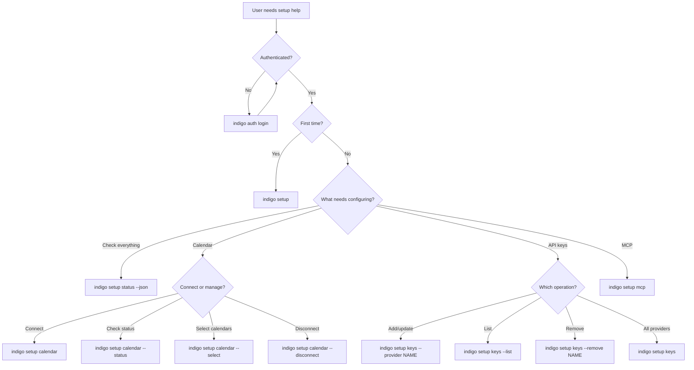

import { Steps, Tabs, TabItem, Aside, Card, CardGrid } from "@astrojs/starlight/components";

The `setup` command group handles initial configuration of the Indigo CLI -- connecting calendars, managing AI provider API keys (BYOK), and configuring MCP for Claude Desktop. This skill page gives agents the structured context needed to walk users through first-time setup and ongoing configuration changes.

## When to use these commands

Use the `setup` commands when a user needs to:

- Complete first-time Indigo configuration after installing the CLI
- Connect or manage their Google Calendar integration
- Add, update, or remove AI provider API keys (BYOK)
- Connect Claude Desktop or another AI assistant to Indigo via MCP (OAuth or SSE)
- Check the overall configuration status of their Indigo installation

<Aside type="tip">
The setup wizard is interactive and cannot run in `--json` mode. When an agent needs to check configuration state programmatically, use `indigo setup status --json` instead.
</Aside>

## Commands at a glance

| Command | Purpose | Interactive |
|---------|---------|:-----------:|
| `indigo setup` | Launch the full setup wizard | Yes |
| `indigo setup wizard` | Alias for the setup wizard | Yes |
| `indigo setup status` | Show configuration status | No (`--json` supported) |
| `indigo setup calendar` | Connect Google Calendar (OAuth) | Yes |
| `indigo setup calendar --status` | Check calendar connection status | No (`--json` supported) |
| `indigo setup calendar --select` | Choose which calendars to sync | Yes |
| `indigo setup calendar --disconnect` | Disconnect Google Calendar | Yes (confirmation) |
| `indigo setup keys` | Interactive setup for all BYOK providers | Yes |
| `indigo setup keys --list` | List configured API key providers | No (`--json` supported) |
| `indigo setup keys --provider <name>` | Configure a specific provider | Yes |
| `indigo setup keys --remove <name>` | Remove a provider's API key | Yes (confirmation) |
| `indigo setup mcp` | Show MCP connection options (OAuth + SSE) | No (`--json` supported) |

## First-time user workflow

When helping a user set up Indigo for the first time, follow these steps in order:

<Steps>

1. **Verify authentication** -- The user must be logged in before any setup commands work.

   ```bash
   indigo auth status --json
   ```

   If not authenticated, direct them to log in first:

   ```bash
   indigo auth login
   ```

2. **Run the setup wizard** -- This walks through all configuration steps interactively.

   ```bash
   indigo setup
   ```

   The wizard covers four steps: authentication verification, API keys (BYOK), calendar connection, and MCP setup. The user can skip any step and complete it later.

3. **Connect Google Calendar** -- If the user skipped calendar setup in the wizard, run it separately.

   ```bash
   indigo setup calendar
   ```

   This opens a browser for Google OAuth authorization, then prompts the user to select which calendars to sync.

4. **Configure MCP for Claude Desktop** -- Connect the user's AI assistant to their Indigo data.

   ```bash
   indigo setup mcp
   ```

   This provides two connection options: OAuth (recommended) and SSE with API key.

</Steps>

<Aside type="note">
Each step can be run independently. The wizard is a convenience wrapper -- agents can call individual subcommands when only a specific configuration change is needed.
</Aside>

## Setup wizard

The setup wizard (`indigo setup` or `indigo setup wizard`) runs an interactive 4-step flow:

| Step | Name | What it does |
|------|------|-------------|
| 1 | Authentication | Verifies the user is logged in. Exits if not. |
| 2 | API Keys (BYOK) | Prompts to configure AI provider keys. Skippable. |
| 3 | Calendar | Connects Google Calendar via OAuth. Skippable. |
| 4 | MCP (Claude Desktop) | Shows MCP connection options. Skippable. |

**Agent behavior:** The wizard is interactive and requires terminal input. In `--json` mode it returns the current status without starting the wizard:

```bash
indigo setup wizard --json
```

```json
{
  "success": true,
  "data": {
    "status": "interactive_required",
    "currentStatus": {
      "authentication": true,
      "apiKeys": false,
      "calendar": false
    },
    "message": "Interactive setup required. Run without --json flag to start the wizard."
  }
}
```

## Status check

Use `indigo setup status` to check the overall configuration state without starting the wizard.

```bash
indigo setup status --json
```

```json
{
  "success": true,
  "data": {
    "authentication": {
      "isConfigured": true,
      "user": {
        "id": "user_abc123",
        "email": "user@example.com",
        "name": "Jane Doe"
      },
      "credentialSource": "cli"
    },
    "apiKeys": {
      "isConfigured": true,
      "configured": ["openai", "anthropic"],
      "missing": ["google", "xai"]
    },
    "calendar": {
      "isConfigured": true,
      "email": "user@gmail.com",
      "selectedCalendars": [
        { "id": "primary", "name": "My Calendar" }
      ]
    },
    "overallProgress": {
      "configured": 3,
      "total": 3
    }
  }
}
```

**Decision logic for agents:**

```bash
# Check if setup is complete
indigo setup status --json | jq '.data.overallProgress'
# { "configured": 3, "total": 3 } means fully configured

# Check specific components
indigo setup status --json | jq '.data.apiKeys.configured'
# ["openai", "anthropic"] -- which providers have keys

indigo setup status --json | jq '.data.calendar.isConfigured'
# true or false
```

## Calendar setup

Calendar connectivity enables meeting intelligence features -- meeting preparation insights, attendee information, and meeting-related signals.

### Connect a calendar

```bash
indigo setup calendar
```

This command:

<Steps>

1. Checks authentication status
2. Opens the browser for Google Calendar OAuth authorization
3. Waits for the user to approve access
4. Verifies the connection
5. Prompts to select which calendars to sync

</Steps>

**JSON mode** returns the OAuth URL for scripting instead of opening a browser:

```bash
indigo setup calendar --json
```

```json
{
  "success": true,
  "data": {
    "status": "connect_required",
    "connectUrl": "https://accounts.google.com/o/oauth2/...",
    "message": "Open the URL to authorize Google Calendar access."
  }
}
```

### Check calendar status

```bash
indigo setup calendar --status --json
```

```json
{
  "success": true,
  "data": {
    "isConnected": true,
    "hasGoogleAccount": true,
    "hasCalendarScope": true,
    "email": "user@gmail.com",
    "selectedCalendars": [
      { "id": "primary", "name": "My Calendar" }
    ]
  }
}
```

### Select calendars to sync

```bash
indigo setup calendar --select
```

This lists all available calendars and lets the user toggle which ones are synced. In JSON mode, it returns the list of calendars with their current selection state.

### Disconnect calendar

```bash
indigo setup calendar --disconnect
```

Removes the Google Calendar connection. Prompts for confirmation in interactive mode.

<Aside type="note">
Only Google Calendar is supported. Calendar connectivity can also be configured through the Indigo Desktop app -- the CLI shares the same connection.
</Aside>

## API key management (BYOK)

Indigo supports Bring Your Own Key (BYOK) for AI model providers. Keys are stored server-side and scoped to the user's organization. API key management requires **admin or owner** permissions.

### Supported providers

| Provider | Display name | Key format | Docs |
|----------|-------------|-----------|------|
| `openai` | OpenAI | `sk-...` | [platform.openai.com/api-keys](https://platform.openai.com/api-keys) |
| `anthropic` | Anthropic | `sk-ant-...` | [console.anthropic.com/settings/keys](https://console.anthropic.com/settings/keys) |
| `google` | Google (Gemini) | `AIza...` | [aistudio.google.com/app/apikey](https://aistudio.google.com/app/apikey) |
| `xai` | xAI (Grok) | `xai-...` | [console.x.ai](https://console.x.ai/) |

### Configure all providers interactively

```bash
indigo setup keys
```

Walks through each provider, prompting for an API key. The backend validates each key by making a test API call before saving.

### Configure a specific provider

```bash
indigo setup keys --provider openai
```

Prompts for just that provider's API key.

### List configured providers

```bash
indigo setup keys --list --json
```

```json
{
  "success": true,
  "data": {
    "providers": [
      {
        "provider": "openai",
        "displayName": "OpenAI",
        "isValid": true,
        "lastUsedAt": "2026-02-09T15:30:00Z",
        "createdAt": "2026-01-15T10:00:00Z"
      }
    ],
    "configured": ["openai"],
    "missing": ["anthropic", "google", "xai"]
  }
}
```

### Remove a provider's key

```bash
indigo setup keys --remove openai
```

Prompts for confirmation, then deletes the key server-side. In JSON mode, use:

```bash
indigo setup keys --remove openai --json
```

<Aside type="caution">
API key management requires admin or owner permissions. If a user receives a 403 error, they need to contact their organization admin.
</Aside>

## MCP configuration

MCP (Model Context Protocol) connects AI assistants like Claude Desktop to the user's Indigo data -- signals, meetings, and decisions become queryable through natural language.

```bash
indigo setup mcp
```

This command presents two connection options:

<Tabs>
  <TabItem label="OAuth (Recommended)">
    The simplest approach. The user enters a single URL in their AI assistant:

    ```
    https://mcp.getindigo.ai
    ```

    The assistant handles authentication automatically via OAuth. No config files or API keys needed.

    **Steps for the user:**
    1. Open Claude Desktop (or another MCP-compatible assistant)
    2. Go to Settings and then Servers
    3. Add a new server with the URL `https://mcp.getindigo.ai`
    4. Complete the OAuth sign-in when prompted

    **Claude Desktop config equivalent:**

    ```json
    {
      "mcpServers": {
        "indigo": {
          "url": "https://mcp.getindigo.ai"
        }
      }
    }
    ```
  </TabItem>
  <TabItem label="SSE with API Key">
    For programmatic integrations or clients that require API key authentication. The CLI generates a personal SSE URL with an embedded API key.

    **Steps for the user:**
    1. Run `indigo setup mcp` to generate the SSE config
    2. Open (or create) the Claude Desktop config file
    3. Add the generated JSON configuration
    4. Restart Claude Desktop

    **Generated config example:**

    ```json
    {
      "mcpServers": {
        "indigo": {
          "type": "sse",
          "url": "https://mcp.getindigo.ai/sse?apiKey=<generated-key>"
        }
      }
    }
    ```

    **JSON mode** for automated configuration:

    ```bash
    indigo setup mcp --json
    ```

    ```json
    {
      "success": true,
      "data": {
        "oauth": {
          "url": "https://mcp.getindigo.ai",
          "claudeDesktopConfig": {
            "mcpServers": {
              "indigo": {
                "url": "https://mcp.getindigo.ai"
              }
            }
          },
          "description": "OAuth-based connection (recommended)."
        },
        "sse": {
          "apiKey": "generated-api-key",
          "url": "https://mcp.getindigo.ai/sse?apiKey=generated-api-key",
          "claudeDesktopConfig": {
            "mcpServers": {
              "indigo": {
                "type": "sse",
                "url": "https://mcp.getindigo.ai/sse?apiKey=generated-api-key"
              }
            }
          },
          "description": "SSE with API key for programmatic integrations."
        },
        "configPath": "~/Library/Application Support/Claude/claude_desktop_config.json",
        "platform": "macOS"
      }
    }
    ```
  </TabItem>
</Tabs>

### Config file locations

The Claude Desktop configuration file is located at:

<Tabs>
  <TabItem label="macOS">
    ```
    ~/Library/Application Support/Claude/claude_desktop_config.json
    ```
  </TabItem>
  <TabItem label="Windows">
    ```
    %APPDATA%\Claude\claude_desktop_config.json
    ```
  </TabItem>
  <TabItem label="Linux">
    ```
    ~/.config/Claude/claude_desktop_config.json
    ```
  </TabItem>
</Tabs>

### Verifying MCP setup

After configuration, restart Claude Desktop and try a query:

```
What signals do I have from this week?
```

If Claude returns Indigo signal data, the MCP connection is working. If not, verify:

1. The user is authenticated: `indigo auth status`
2. Claude Desktop has been restarted after adding the config
3. The MCP server appears in Claude Desktop's server list

## Agent decision tree

Use this flowchart to determine which setup command to run based on the user's situation:



## Error handling

| Exit code | Meaning | Agent action |
|-----------|---------|-------------|
| `0` | Success | Continue with next step |
| `1` | General error | Read error message, retry or escalate |
| `2` | Authentication required | Run `indigo auth login` first |
| `3` | API unreachable | Check internet connection, retry later |
| `4` | Configuration error | Calendar not connected or permission denied |

Common error scenarios:

| Error | Cause | Resolution |
|-------|-------|-----------|
| "Not authenticated" | No valid token | `indigo auth login` |
| "Authentication expired" | Token expired | `indigo auth login` |
| "API key management requires admin or owner permissions" | User lacks permissions | Contact organization admin |
| "Invalid API key" | Key failed validation | Check key format and re-enter |
| "Calendar not connected" | Tried `--select` without connecting first | Run `indigo setup calendar` |

## Next steps

<CardGrid>
  <Card title="Auth skills" icon="approve-check">
    Manage login, logout, and credential state.
    [Auth commands](/cli/commands/auth/)
  </Card>
  <Card title="MCP Server" icon="right-arrow">
    Detailed MCP data model, tools, and query patterns.
    [MCP overview](/mcp/overview/)
  </Card>
  <Card title="Automation" icon="right-arrow">
    Build scripts and pipelines using CLI output.
    [Automation guide](/cli/automation/)
  </Card>
</CardGrid>
