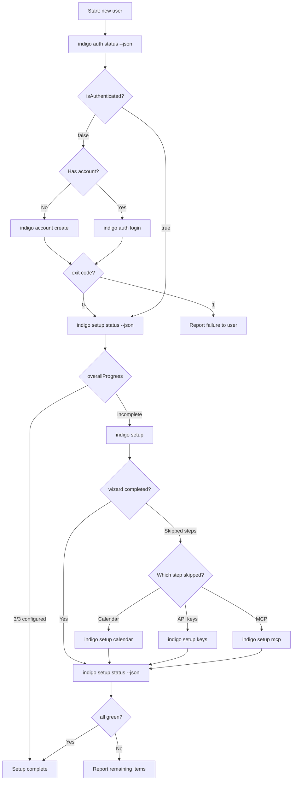
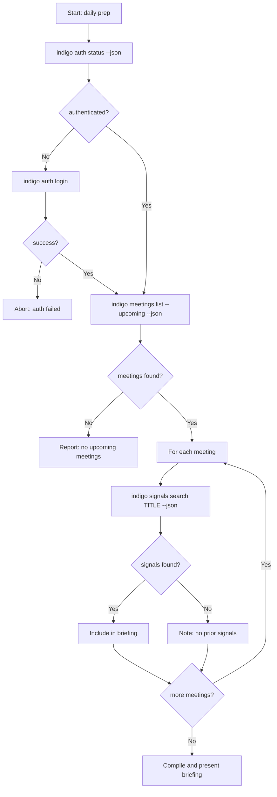
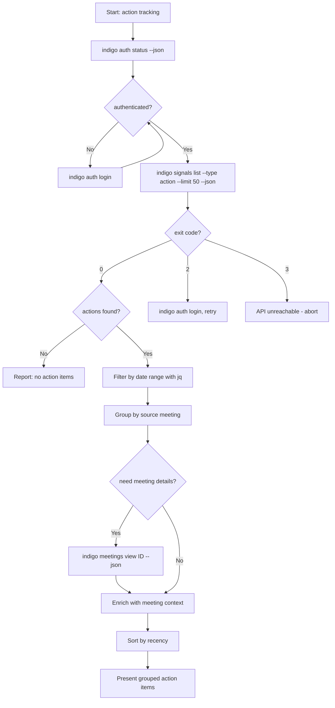
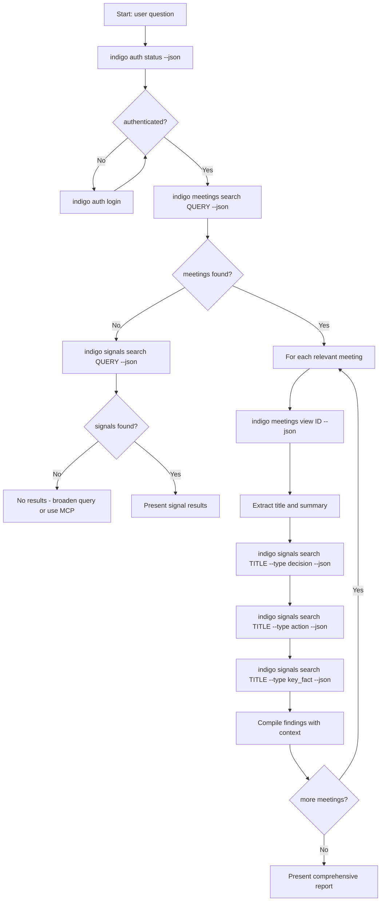

import { Steps, Tabs, TabItem, Aside, Card, CardGrid } from "@astrojs/starlight/components";

This page documents complete multi-step workflows that chain multiple CLI skills together. Each workflow shows the full sequence of commands an agent should execute, including decision points, error handling, and guidance on when to fall back to MCP.

<Aside type="tip">
Every workflow begins with an authentication check. If you are chaining multiple workflows in one session, you only need to verify auth once at the start.
</Aside>

## Workflow 1: First-time setup

Walk a new user from zero to a fully configured Indigo installation. This workflow chains authentication, the setup wizard, calendar connection, and MCP configuration.

### Decision flowchart



### Step-by-step commands

<Steps>

1. **Check authentication status**

   ```bash
   indigo auth status --json
   ```

   Parse `data.isAuthenticated`. If `true`, skip to step 3. If `false`, proceed to step 2.

   **Error handling:** If exit code is `1`, the CLI itself may not be installed. Verify the installation with `indigo --version`.

2. **Authenticate the user**

   If the user has an account:

   ```bash
   indigo auth login
   ```

   If the user needs a new account:

   ```bash
   indigo account create
   ```

   Both commands open a browser window. Wait for exit code `0` before proceeding.

   **Error handling:**
   - Exit code `1` with timeout message: the user did not complete browser auth within 5 minutes. Ask them to try again.
   - Network errors: check internet connectivity and retry.

3. **Check current configuration state**

   ```bash
   indigo setup status --json
   ```

   Parse `data.overallProgress`. If `configured` equals `total`, the user is fully set up. Otherwise, identify which components need configuration from `data.apiKeys.isConfigured`, `data.calendar.isConfigured`, and `data.authentication.isConfigured`.

4. **Run the setup wizard (if needed)**

   ```bash
   indigo setup
   ```

   The wizard is interactive and walks through all remaining configuration. If the user skips steps, run individual commands for each skipped component.

5. **Ensure calendar is connected**

   ```bash
   indigo setup calendar --status --json
   ```

   If `data.isConnected` is `false`:

   ```bash
   indigo setup calendar
   ```

   **Error handling:** Exit code `4` means the user needs to authorize Google Calendar access. The command opens a browser for OAuth.

6. **Configure MCP for AI assistants**

   ```bash
   indigo setup mcp --json
   ```

   Present the OAuth URL (`data.oauth.url`) to the user. For programmatic setups, use the SSE config from `data.sse.claudeDesktopConfig`.

7. **Final verification**

   ```bash
   indigo setup status --json
   ```

   Confirm `data.overallProgress.configured` equals `data.overallProgress.total`. Report any remaining items to the user.

</Steps>

### Example agent script

```bash
#!/bin/bash
# Complete first-time setup workflow

set -e

echo "=== Indigo First-Time Setup ==="

# Step 1: Check auth
STATUS=$(indigo auth status --json 2>/dev/null)
IS_AUTH=$(echo "$STATUS" | jq -r '.data.isAuthenticated')

if [ "$IS_AUTH" != "true" ]; then
  echo "Not authenticated. Starting login..."
  indigo auth login --json
  if [ $? -ne 0 ]; then
    echo "ERROR: Authentication failed. Please try again."
    exit 2
  fi
fi

# Step 2: Check what needs configuring
SETUP=$(indigo setup status --json)
CONFIGURED=$(echo "$SETUP" | jq -r '.data.overallProgress.configured')
TOTAL=$(echo "$SETUP" | jq -r '.data.overallProgress.total')

if [ "$CONFIGURED" -eq "$TOTAL" ]; then
  echo "Setup is already complete ($CONFIGURED/$TOTAL configured)."
  exit 0
fi

echo "Setup progress: $CONFIGURED/$TOTAL. Running wizard..."

# Step 3: Run interactive wizard
indigo setup

# Step 4: Verify calendar
CAL_STATUS=$(indigo setup calendar --status --json)
CAL_CONNECTED=$(echo "$CAL_STATUS" | jq -r '.data.isConnected')

if [ "$CAL_CONNECTED" != "true" ]; then
  echo "Calendar not connected. Starting calendar setup..."
  indigo setup calendar
fi

# Step 5: Show MCP config
echo ""
echo "=== MCP Configuration ==="
indigo setup mcp --json | jq '.data.oauth'

# Step 6: Final check
FINAL=$(indigo setup status --json)
echo ""
echo "=== Final Status ==="
echo "$FINAL" | jq '.data.overallProgress'
```

### When to fall back to MCP

MCP is not relevant during first-time setup. The CLI is the only interface for authentication, configuration, and calendar connectivity. MCP setup is the _last_ step of this workflow -- once configured, the user can switch to MCP for data queries.

---

## Workflow 2: Daily meeting prep

Prepare a user for their upcoming meetings by gathering meeting details and relevant signals for each one. This is a read-heavy workflow that combines meeting and signal queries.

### Decision flowchart



### Step-by-step commands

<Steps>

1. **Verify authentication**

   ```bash
   indigo auth status --json
   ```

   If not authenticated, run `indigo auth login`. Do not proceed until auth succeeds.

2. **List upcoming meetings**

   ```bash
   indigo meetings list --upcoming --limit 10 --json
   ```

   Parse the JSON array. Each object has `_id`, `meeting_title`, `start_time`, `end_time`, and `participants`.

   **Error handling:**
   - Exit code `2`: authentication expired. Run `indigo auth login`.
   - Exit code `4`: calendar not connected. Run `indigo setup calendar`.
   - Empty array: no upcoming meetings. Report this to the user.

3. **For each meeting, search for related signals**

   Use the meeting title to find relevant prior intelligence:

   ```bash
   indigo signals search "Weekly Product Sync" --limit 10 --json
   ```

   This returns decisions, actions, accomplishments, and key facts related to that meeting topic.

   **Error handling:** If the search returns an empty array, note that no prior signals exist for this meeting. This is normal for new or one-off meetings.

4. **Optionally, get participant details**

   For meetings with external participants, view full meeting details:

   ```bash
   indigo meetings view <meeting_id> --json
   ```

   Extract the `participants` array to identify attendees and their RSVP status.

5. **Compile the briefing**

   For each meeting, present:
   - Meeting title, time, and participants
   - Related decisions from prior meetings
   - Open action items from prior meetings
   - Key facts or context the user should know

</Steps>

### Example agent script

```bash
#!/bin/bash
# Daily meeting prep: gather intelligence for upcoming meetings

# Step 1: Auth check
indigo auth status --json > /dev/null 2>&1
if [ $? -ne 0 ]; then
  echo "Auth check failed. Attempting login..."
  indigo auth login
fi

# Step 2: Get upcoming meetings
MEETINGS=$(indigo meetings list --upcoming --limit 10 --json)
COUNT=$(echo "$MEETINGS" | jq 'length')

if [ "$COUNT" -eq 0 ]; then
  echo "No upcoming meetings found."
  exit 0
fi

echo "Found $COUNT upcoming meetings. Gathering intelligence..."
echo ""

# Step 3: For each meeting, search for related signals
echo "$MEETINGS" | jq -c '.[]' | while IFS= read -r meeting; do
  TITLE=$(echo "$meeting" | jq -r '.meeting_title')
  START=$(echo "$meeting" | jq -r '.start_time')
  MEETING_ID=$(echo "$meeting" | jq -r '._id')

  echo "========================================"
  echo "Meeting: $TITLE"
  echo "Time:    $START"
  echo "========================================"

  # Get participant list
  PARTICIPANTS=$(indigo meetings view "$MEETING_ID" --json | jq -r '[.participants[].displayName // .participants[].email] | join(", ")')
  echo "Attendees: $PARTICIPANTS"
  echo ""

  # Search for related decisions
  DECISIONS=$(indigo signals search "$TITLE" --type decision --limit 5 --json)
  DEC_COUNT=$(echo "$DECISIONS" | jq 'length')
  echo "Related decisions: $DEC_COUNT"
  if [ "$DEC_COUNT" -gt 0 ]; then
    echo "$DECISIONS" | jq -r '.[].data.decision' | while read -r d; do
      echo "  - $d"
    done
  fi

  # Search for open action items
  ACTIONS=$(indigo signals search "$TITLE" --type action --limit 5 --json)
  ACT_COUNT=$(echo "$ACTIONS" | jq 'length')
  echo "Open action items: $ACT_COUNT"
  if [ "$ACT_COUNT" -gt 0 ]; then
    echo "$ACTIONS" | jq -r '.[].data.action_item' | while read -r a; do
      echo "  - $a"
    done
  fi

  echo ""
done
```

### When to fall back to MCP

Fall back to MCP when the daily prep requires:

- **Cross-meeting aggregation** -- finding patterns across many meetings (e.g., "all decisions made by the product team this month"). The CLI's `--limit` and single-type filter make this tedious. MCP's `query_collection` with compound filters handles this in one call.
- **Custom date ranges** -- the CLI does not expose `startDate`/`endDate` flags for signals. For precise date filtering, use MCP's `query_collection` with date filter operators.
- **Attendee-based signal queries** -- if you need signals specifically from meetings where a particular person spoke, MCP allows filtering by `sourceMetadata.participants`.

---

## Workflow 3: Action item tracking

Find and compile open action items across meetings, grouped by meeting and sorted by recency. This workflow focuses on the `action` signal type.

### Decision flowchart



### Step-by-step commands

<Steps>

1. **Verify authentication**

   ```bash
   indigo auth status --json
   ```

2. **Retrieve action items**

   ```bash
   indigo signals list --type action --limit 50 --json
   ```

   This returns up to 50 action items, sorted by recency (newest first).

   **Error handling:**
   - Exit code `2`: re-authenticate with `indigo auth login`.
   - Exit code `3`: API is unreachable. Report the network issue to the user.
   - Empty array: no action items found. This may mean the user has no meetings processed yet, or no action items were extracted.

3. **Filter by date range (optional)**

   The CLI does not have date flags for signals. Use `jq` to filter:

   ```bash
   # Action items from the past 7 days
   indigo signals list --type action --limit 50 --json \
     | jq --arg since "$(date -u -d '7 days ago' +%Y-%m-%dT%H:%M:%SZ)" \
       '[.[] | select(.createdAt >= $since)]'
   ```

   On macOS, use `date -u -v-7d +%Y-%m-%dT%H:%M:%SZ` instead.

4. **Group by source meeting**

   ```bash
   indigo signals list --type action --limit 50 --json \
     | jq 'group_by(.source.id) | map({
         meeting_id: .[0].source.id,
         meeting_source: .[0].sourceMetadata.sourceChannel,
         count: length,
         actions: [.[].data.action_item]
       })'
   ```

5. **Enrich with meeting context (optional)**

   For each unique source meeting, fetch details:

   ```bash
   indigo meetings view <meeting_id> --json
   ```

   Extract `meeting_title` and `start_time` to annotate the grouped output.

6. **Present the results**

   Group action items by meeting, showing:
   - Meeting title and date
   - Each action item with its assignee (from `data.assignee`) and status (from `data.status`)
   - Total count of open items

</Steps>

### Example agent script

```bash
#!/bin/bash
# Action item tracking: find and group open action items

# Step 1: Auth check
STATUS=$(indigo auth status --json 2>/dev/null)
IS_AUTH=$(echo "$STATUS" | jq -r '.data.isAuthenticated')

if [ "$IS_AUTH" != "true" ]; then
  indigo auth login --json
  if [ $? -ne 0 ]; then
    echo "ERROR: Authentication failed."
    exit 2
  fi
fi

# Step 2: Get all action items
ACTIONS=$(indigo signals list --type action --limit 50 --json)
TOTAL=$(echo "$ACTIONS" | jq 'length')

if [ "$TOTAL" -eq 0 ]; then
  echo "No action items found."
  exit 0
fi

echo "Found $TOTAL action items."
echo ""

# Step 3: Group by source meeting and display
echo "$ACTIONS" | jq -r '
  group_by(.source.id) |
  sort_by(-(.[-1].createdAt | fromdateiso8601)) |
  .[] |
  "=== Meeting: \(.[0].sourceMetadata.sourceChannel // "unknown") ===\n" +
  "Source ID: \(.[0].source.id)\n" +
  "Items: \(length)\n" +
  (reduce .[] as $a ("";
    . + "  - \($a.data.action_item // "No description")" +
    if $a.data.assignee then " (assigned: \($a.data.assignee))" else "" end +
    "\n"
  ))
'

# Step 4: Summary
echo ""
echo "=== Summary ==="
echo "Total action items: $TOTAL"
echo "$ACTIONS" | jq -r '
  group_by(.source.id) | length | "Across \(.) meeting(s)"
'
```

### When to fall back to MCP

Fall back to MCP when action item tracking requires:

- **Status-based filtering** -- if you need only open or completed action items and the `data.status` field varies, MCP's `query_collection` can filter on nested fields directly.
- **Assignee aggregation** -- counting action items per person across all meetings. MCP's `aggregate_collection` with `$group` is significantly more efficient than fetching all items and grouping client-side.
- **Large result sets** -- the CLI's `--limit` caps at a reasonable number. For comprehensive audits spanning months of data, MCP provides proper pagination and cursor-based iteration.

---

## Workflow 4: Meeting intelligence search

Perform a deep search across meetings and signals to answer a user's question. This workflow starts broad (meeting search), then drills into specific meetings, and finally cross-references signals to build a comprehensive answer.

### Decision flowchart



### Step-by-step commands

<Steps>

1. **Verify authentication**

   ```bash
   indigo auth status --json
   ```

2. **Search meetings for the topic**

   ```bash
   indigo meetings search "quarterly planning" --json
   ```

   This searches meeting titles, descriptions, and participant names. Parse the results to identify the most relevant meetings.

   **Error handling:**
   - Exit code `4`: calendar not connected. Run `indigo setup calendar`.
   - Exit code `5`: empty query. Ensure the search term is not blank.
   - Empty results: the topic may not match any meeting title or description. Proceed to signal search (step 3 alternate path).

3. **View details for matching meetings**

   For each relevant meeting from the search results:

   ```bash
   indigo meetings view <meeting_id> --json
   ```

   Extract the `summary` field for a high-level overview and the `meeting_title` for signal cross-referencing.

4. **Search signals by meeting title**

   For each meeting, search for all signal types:

   ```bash
   # Decisions from this meeting
   indigo signals search "Quarterly Planning Review" --type decision --json

   # Action items from this meeting
   indigo signals search "Quarterly Planning Review" --type action --json

   # Key facts from this meeting
   indigo signals search "Quarterly Planning Review" --type key_fact --json

   # Accomplishments from this meeting
   indigo signals search "Quarterly Planning Review" --type accomplishment --json
   ```

   **Error handling:** Empty results for a signal type are normal. Not every meeting produces every type of signal.

5. **Also search signals directly (catch-all)**

   The meeting title search may miss signals that mention the topic but came from a differently-named meeting:

   ```bash
   indigo signals search "quarterly planning" --json
   ```

   Merge these results with the meeting-specific results, deduplicating by `_id`.

6. **Compile the report**

   Present findings organized by meeting, then by signal type:
   - Meeting title, date, and summary
   - Decisions made
   - Action items assigned
   - Key facts noted
   - Accomplishments recorded
   - Citations with speaker attribution (from `citations` array)

</Steps>

### Example agent script

```bash
#!/bin/bash
# Meeting intelligence search: deep search across meetings and signals

QUERY="$1"
if [ -z "$QUERY" ]; then
  echo "Usage: $0 <search-query>"
  exit 1
fi

# Step 1: Auth check
indigo auth status --json > /dev/null 2>&1
if [ $? -ne 0 ]; then
  indigo auth login
fi

echo "=== Searching for: $QUERY ==="
echo ""

# Step 2: Search meetings
MEETINGS=$(indigo meetings search "$QUERY" --limit 5 --json)
MTG_COUNT=$(echo "$MEETINGS" | jq 'length')

# Step 3: Also search signals directly
DIRECT_SIGNALS=$(indigo signals search "$QUERY" --limit 10 --json)
SIG_COUNT=$(echo "$DIRECT_SIGNALS" | jq 'length')

echo "Found $MTG_COUNT matching meetings and $SIG_COUNT direct signal matches."
echo ""

# Step 4: For each meeting, gather intelligence
if [ "$MTG_COUNT" -gt 0 ]; then
  echo "$MEETINGS" | jq -c '.[]' | while IFS= read -r meeting; do
    TITLE=$(echo "$meeting" | jq -r '.meeting_title')
    MTG_ID=$(echo "$meeting" | jq -r '._id')
    START=$(echo "$meeting" | jq -r '.start_time')

    echo "========================================"
    echo "Meeting: $TITLE"
    echo "Date:    $START"
    echo "========================================"

    # Get meeting summary
    DETAILS=$(indigo meetings view "$MTG_ID" --json)
    SUMMARY=$(echo "$DETAILS" | jq -r '.summary // "No summary available"')
    echo "Summary: $SUMMARY"
    echo ""

    # Get signals by type
    for TYPE in decision action key_fact accomplishment; do
      SIGNALS=$(indigo signals search "$TITLE" --type "$TYPE" --limit 5 --json)
      TYPE_COUNT=$(echo "$SIGNALS" | jq 'length')
      if [ "$TYPE_COUNT" -gt 0 ]; then
        echo "  ${TYPE}s ($TYPE_COUNT):"
        echo "$SIGNALS" | jq -r ".[].data.${TYPE} // .[].data.action_item // .[].data.key_fact // \"(see details)\"" | while read -r item; do
          echo "    - $item"
        done
      fi
    done
    echo ""
  done
fi

# Step 5: Show direct signal matches not tied to a specific meeting
if [ "$SIG_COUNT" -gt 0 ]; then
  echo "========================================"
  echo "Additional signal matches (direct search)"
  echo "========================================"
  echo "$DIRECT_SIGNALS" | jq -r '.[] | "  [\(.insightType)] \(.data | to_entries | .[0].value)"'
fi
```

### When to fall back to MCP

Fall back to MCP when meeting intelligence search requires:

- **Complex boolean queries** -- the CLI search is single-term full-text. For queries like "pricing AND launch NOT internal", MCP's `query_collection` supports richer filter expressions.
- **Cross-collection joins** -- correlating signals with specific meeting attendees or linking decisions to the people who made them. MCP can run queries against both collections in sequence with fine-grained field projections.
- **Result aggregation** -- counting how many times a topic appeared, trending signals over time, or building dashboards. Use MCP's `aggregate_collection` with `$group`, `$sort`, and `$bucket` stages.
- **Very large result sets** -- when a broad query returns hundreds of results and you need pagination, sorting, or field projections to manage the volume efficiently.

---

## Common patterns across all workflows

### Authentication guard

Every workflow starts with the same authentication check. Extract this into a reusable pattern:

```bash
# Reusable auth guard
ensure_auth() {
  STATUS=$(indigo auth status --json 2>/dev/null)
  IS_AUTH=$(echo "$STATUS" | jq -r '.data.isAuthenticated // false')
  if [ "$IS_AUTH" != "true" ]; then
    indigo auth login --json
    if [ $? -ne 0 ]; then
      echo "Authentication failed. Cannot proceed." >&2
      return 1
    fi
  fi
  return 0
}

ensure_auth || exit 2
```

### Exit code handling

All CLI commands share the same exit code scheme. Handle them consistently:

| Code | Meaning | Recovery |
|------|---------|----------|
| `0` | Success | Continue |
| `1` | General error | Read error message, retry once |
| `2` | Auth required | Run `indigo auth login`, then retry the command |
| `3` | API unreachable | Check network, retry after delay |
| `4` | Config error | Run relevant `indigo setup` command |
| `5` | Validation error | Fix the command (bad flag or argument) |
| `6` | Not found | The requested resource does not exist |

### JSON-first principle

Always use `--json` when commands will be parsed by an agent. The human-readable output truncates data and changes format between versions. JSON output is the stable contract.

```bash
# Always this:
indigo signals list --type action --json | jq '.[0].data.action_item'

# Never parse this:
indigo signals list --type action | grep "action item"
```

### CLI vs MCP decision guide

<Tabs>
  <TabItem label="Stay with CLI when">
    - The workflow is linear (step 1 then step 2 then step 3)
    - You need exit codes for error handling and branching
    - Each step produces a small, bounded result set (under 50 items)
    - You are building shell scripts or CI/CD pipelines
    - The task involves setup, auth, or configuration
  </TabItem>
  <TabItem label="Switch to MCP when">
    - You need to aggregate across large data sets (counts, trends, grouping)
    - You need compound filters the CLI does not support (multiple types, date ranges, nested field queries)
    - You are working inside Claude Desktop or another MCP-capable client
    - The query would require multiple CLI calls that MCP can handle in one request
    - You need pagination through hundreds of results
  </TabItem>
</Tabs>

## Related

<CardGrid>
  <Card title="Authentication" icon="approve-check">
    Login, status checks, and credential management.
    [Auth skills](/cli/skills/authentication/)
  </Card>
  <Card title="Signals" icon="list-format">
    List, search, and view meeting intelligence.
    [Signal skills](/cli/skills/signals/)
  </Card>
  <Card title="Meetings" icon="comment-alt">
    Browse and search calendar meetings.
    [Meeting skills](/cli/skills/meetings/)
  </Card>
  <Card title="Setup" icon="setting">
    Configuration, calendar, API keys, and MCP.
    [Setup skills](/cli/skills/setup/)
  </Card>
</CardGrid>
