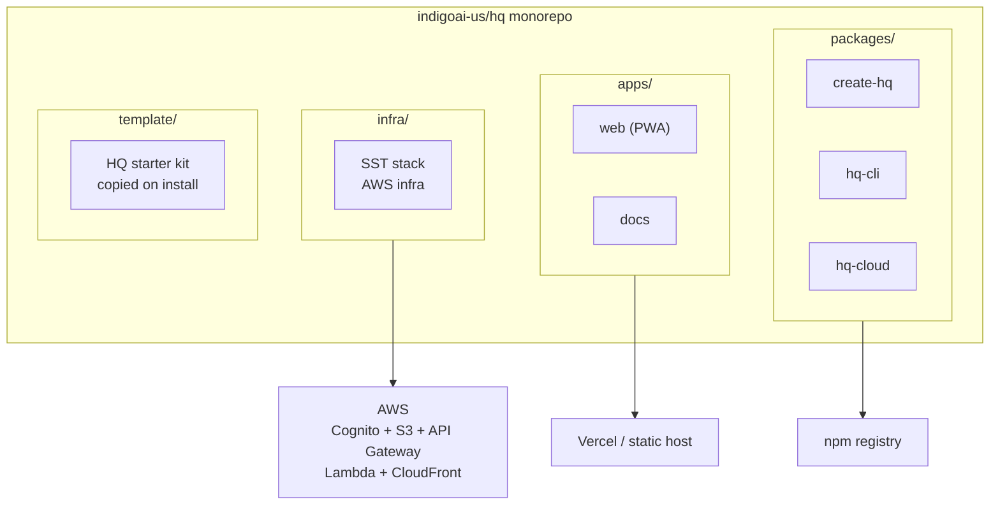
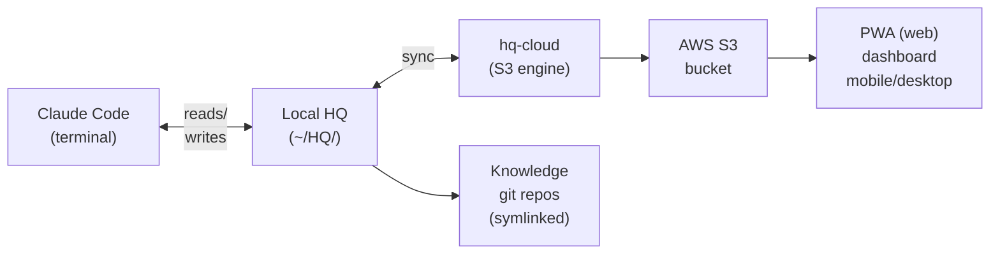
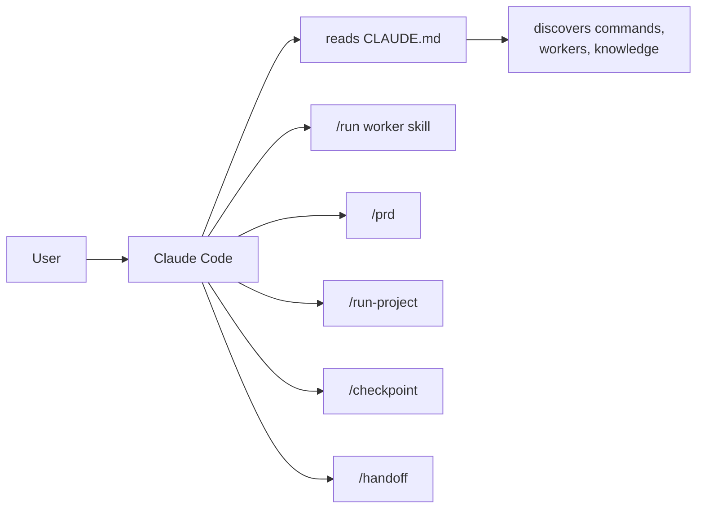
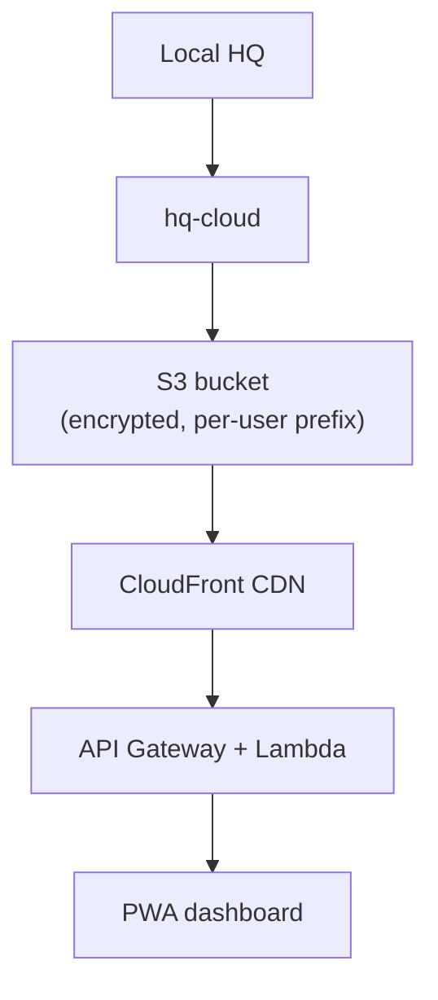
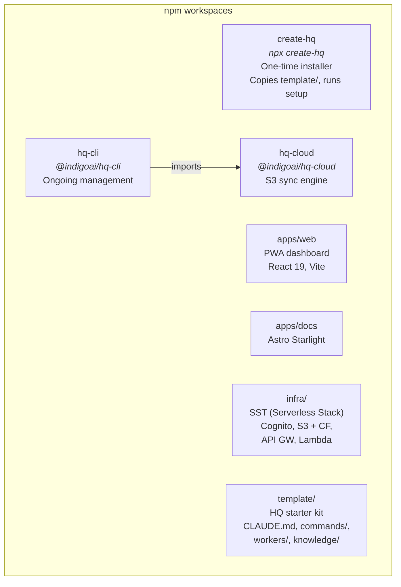
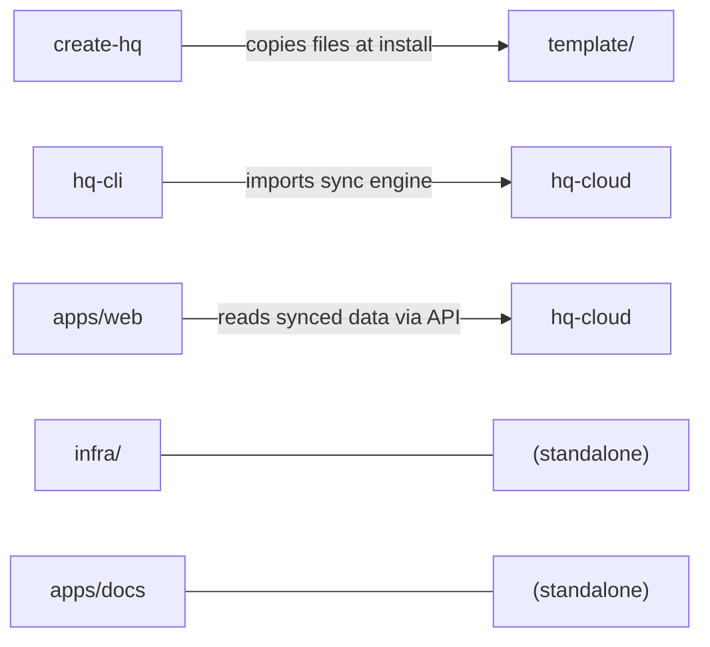

## System Architecture

HQ is a monorepo that ships five packages, a documentation site, and cloud infrastructure. The user interacts with HQ through Claude Code locally, and optionally through a PWA dashboard on mobile. Cloud sync bridges the two.



### Runtime Flow



## Data Flow

HQ follows a linear progression from install to daily use:

### 1. Install

```bash
npx create-hq
```

`create-hq` scaffolds a new HQ directory from `template/`, installs dependencies, and optionally runs `/setup` for interactive configuration.

### 2. Setup

The `/setup` command walks through:
- Company configuration (names, settings)
- API credentials (per company)
- Worker selection and activation
- Knowledge base initialization
- Cloud sync credentials (optional)

### 3. Work

Daily workflow happens entirely through Claude Code:



All state lives in the filesystem. Workers read knowledge, write reports, update threads, and commit to git repos.

### 4. Sync

`hq-cloud` synchronizes the local HQ directory to S3:



Sync is selective — only workspace state, reports, and social drafts are synced. Git repos, node_modules, and credentials are excluded.

### 5. Mobile

The PWA dashboard (`apps/web`) provides read access to:
- Active threads and checkpoints
- Reports and social drafts
- Worker status and project progress
- Quick actions (approve posts, review reports)

Authentication flows through AWS Cognito. Content is served from S3 via CloudFront.

## Package Graph



### Dependency Direction



Packages are loosely coupled. `create-hq` only touches `template/` at install time and has no runtime dependency on other packages. `hq-cli` is the primary user-facing package and depends on `hq-cloud` for sync operations.

## Technology Stack

### Core

| Technology | Purpose | Rationale |
|---|---|---|
| **Node.js 18+** | Runtime | Universal JS runtime, native in Claude Code environments |
| **TypeScript** | Language | Type safety across all packages, better IDE support |
| **npm workspaces** | Monorepo | Zero-config workspace management, native to npm |

### Packages

| Technology | Package | Rationale |
|---|---|---|
| **Commander.js** | create-hq, hq-cli | Standard Node.js CLI framework |
| **AWS SDK v3** | hq-cloud | Modular AWS client, tree-shakeable |
| **zod** | hq-cli, hq-cloud | Runtime schema validation for configs |

### Frontend (apps/web)

| Technology | Purpose | Rationale |
|---|---|---|
| **React 19** | UI framework | Latest React with concurrent features |
| **Vite** | Build tool | Fast HMR, native ESM, minimal config |
| **Tailwind CSS** | Styling | Utility-first, consistent design system |
| **PWA** | Mobile access | Installable on any device, no app store required |

### Documentation (apps/docs)

| Technology | Purpose | Rationale |
|---|---|---|
| **Astro** | Framework | Static-first, fast builds, content-focused |
| **Starlight** | Theme | Purpose-built for documentation, search included |
| **MDX** | Content | Markdown with component support |

### Infrastructure (infra/)

| Technology | Purpose | Rationale |
|---|---|---|
| **SST** | IaC framework | TypeScript-native, live Lambda debugging |
| **AWS Cognito** | Auth | Managed user pools, JWT tokens |
| **AWS S3** | Storage | Encrypted file storage, per-user prefixes |
| **API Gateway** | API layer | RESTful endpoints for PWA |
| **Lambda** | Compute | Serverless functions for API handlers |
| **CloudFront** | CDN | Global edge caching for PWA assets and API |

### Why These Choices

**npm workspaces over Turborepo/Nx:** HQ is a modest monorepo (5 packages). npm workspaces provide native workspace linking and script orchestration without adding a build system dependency. If the repo grows significantly, Turborepo can be layered on top without migration.

**SST over CDK/Terraform:** SST wraps AWS CDK with TypeScript-native constructs and provides live Lambda debugging during development. This aligns with the all-TypeScript stack and reduces the feedback loop for infrastructure changes.

**Astro Starlight over Docusaurus/Nextra:** Starlight is purpose-built for documentation. It ships with search, navigation, and i18n out of the box. Astro's partial hydration means zero JS ships to the client by default.

**PWA over native app:** HQ's mobile needs are read-heavy (view reports, approve posts). A PWA provides installable mobile access without app store overhead, and shares the same React codebase.
