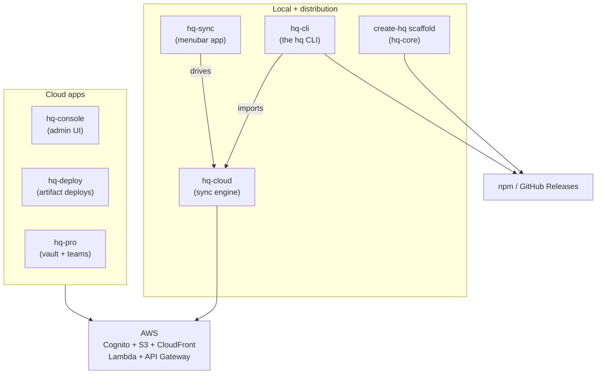
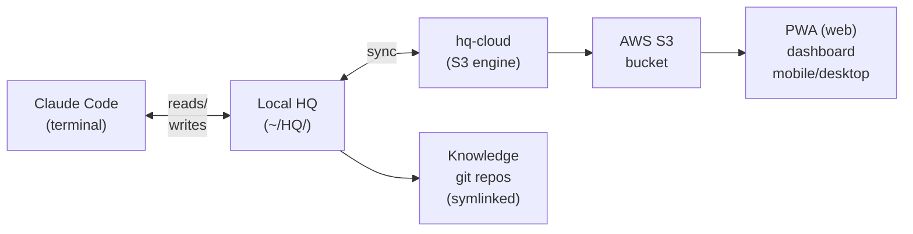
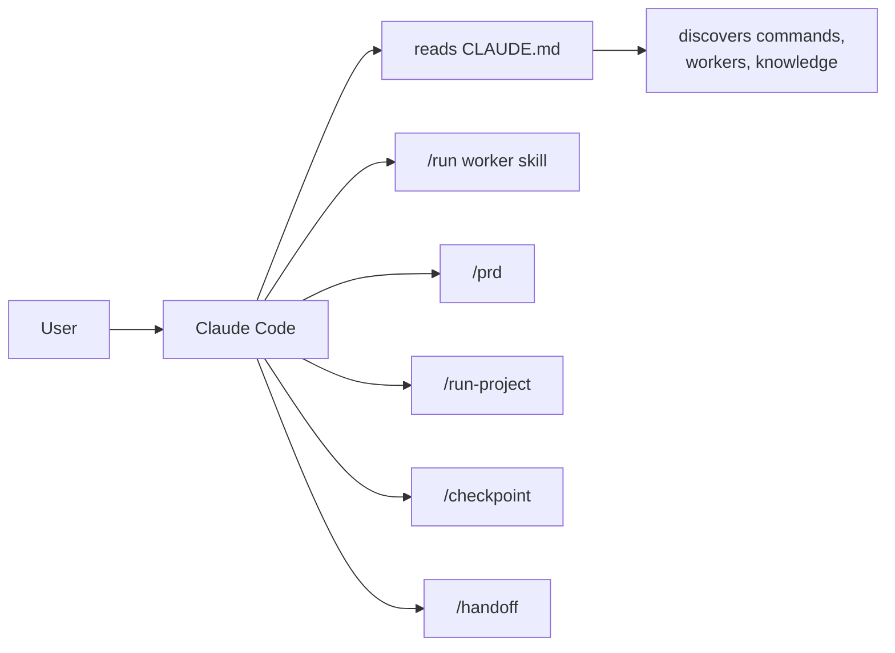
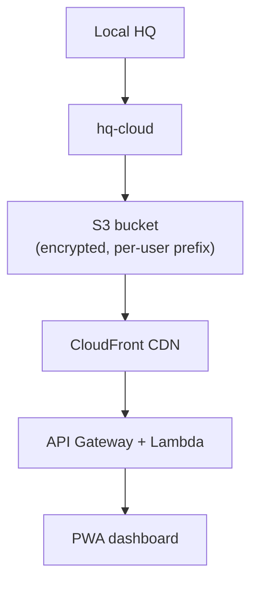
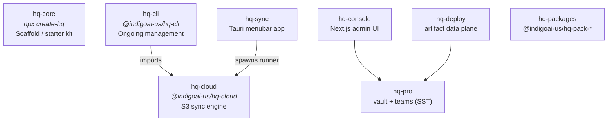
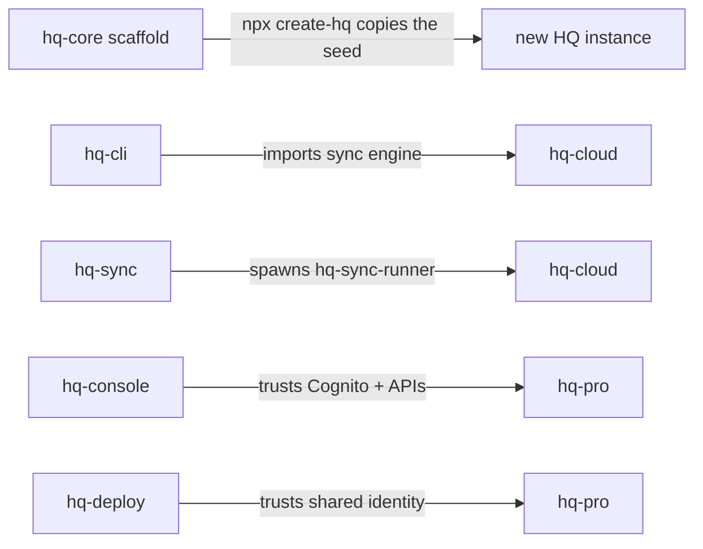

## System Architecture

HQ ships as a set of independently versioned repos — a CLI, a cloud sync engine, a scaffold, desktop and admin apps, and shared cloud infrastructure — rather than one combined repository. The user interacts with HQ through Claude Code locally, and optionally through a desktop menubar app and an admin console. Cloud sync bridges local and cloud. See the [Ecosystem & Repo Map](/hq/architecture/2-ecosystem/) for how the repos compose.


```mermaid
graph TD
    subgraph local["Local + distribution"]
        direction TB
        createhq["create-hq scaffold<br/>(hq-core)"]
        hqcli["hq-cli<br/>(the hq CLI)"]
        hqcloud["hq-cloud<br/>(sync engine)"]
        hqsync["hq-sync<br/>(menubar app)"]
        hqcli -->|imports| hqcloud
        hqsync -->|drives| hqcloud
    end
    subgraph cloudapps["Cloud apps"]
        console["hq-console<br/>(admin UI)"]
        deploy["hq-deploy<br/>(artifact deploys)"]
        pro["hq-pro<br/>(vault + teams)"]
    end
    createhq --> npm["npm / GitHub Releases"]
    hqcli --> npm
    cloudapps --> aws["AWS<br/>Cognito + S3 + CloudFront<br/>Lambda + API Gateway"]
    hqcloud --> aws
```

### Runtime Flow


```mermaid
graph LR
    claude["Claude Code<br/>(terminal)"] <-->|"reads/<br/>writes"| local["Local HQ<br/>(~/HQ/)"]
    local <-->|sync| cloud["hq-cloud<br/>(S3 engine)"]
    local --> knowledge["Knowledge<br/>git repos<br/>(symlinked)"]
    cloud --> s3["AWS S3<br/>bucket"]
    s3 --> pwa["PWA (web)<br/>dashboard<br/>mobile/desktop"]
```

## Data Flow

HQ follows a linear progression from install to daily use:

### 1. Install

```bash
npx create-hq
```

`create-hq` scaffolds a new HQ directory from `template/`, installs dependencies, and optionally runs `/setup` for interactive configuration.

### 2. Setup

The `/setup` command walks through:
- Company configuration (names, settings)
- API credentials (per company)
- Worker selection and activation
- Knowledge base initialization
- Cloud sync credentials (optional)

### 3. Work

Daily workflow happens entirely through Claude Code:


```mermaid
graph LR
    user["User"] --> cc["Claude Code"]
    cc --> claude["reads CLAUDE.md"]
    claude --> discover["discovers commands,<br/>workers, knowledge"]
    cc --> run["/run worker skill"]
    cc --> prd["/prd"]
    cc --> rp["/run-project"]
    cc --> cp["/checkpoint"]
    cc --> ho["/handoff"]
```

All state lives in the filesystem. Workers read knowledge, write reports, update threads, and commit to git repos.

### 4. Sync

`hq-cloud` synchronizes the local HQ directory to S3:


```mermaid
graph TD
    local["Local HQ"] --> cloud["hq-cloud"]
    cloud --> s3["S3 bucket<br/>(encrypted, per-user prefix)"]
    s3 --> cdn["CloudFront CDN"]
    cdn --> apigw["API Gateway + Lambda"]
    apigw --> pwa["PWA dashboard"]
```

Sync is selective — only workspace state, reports, and social drafts are synced. Git repos, node_modules, and credentials are excluded.

### 5. Mobile

The PWA dashboard provides read access to:
- Active threads and checkpoints
- Reports and social drafts
- Worker status and project progress
- Quick actions (approve posts, review reports)

Authentication flows through AWS Cognito. Content is served from S3 via CloudFront.

## Repo Graph

Each surface is its own repo and ships on its own cadence. For the full breakdown, see the [Ecosystem & Repo Map](/hq/architecture/2-ecosystem/).


```mermaid
graph TD
    createhq["hq-core<br/><i>npx create-hq</i><br/>Scaffold / starter kit"]
    hqcli["hq-cli<br/><i>@indigoai-us/hq-cli</i><br/>Ongoing management"]
    hqcloud["hq-cloud<br/><i>@indigoai-us/hq-cloud</i><br/>S3 sync engine"]
    hqsync["hq-sync<br/>Tauri menubar app"]
    hqcli -->|imports| hqcloud
    hqsync -->|spawns runner| hqcloud
    console["hq-console<br/>Next.js admin UI"]
    deploy["hq-deploy<br/>artifact data plane"]
    pro["hq-pro<br/>vault + teams (SST)"]
    packs["hq-packages<br/>@indigoai-us/hq-pack-*"]
    console --> pro
    deploy --> pro
```

### Dependency Direction


```mermaid
graph LR
    createhq["hq-core scaffold"] -->|"npx create-hq copies the seed"| inst["new HQ instance"]
    hqcli["hq-cli"] -->|"imports sync engine"| hqcloud["hq-cloud"]
    hqsync["hq-sync"] -->|"spawns hq-sync-runner"| hqcloud2["hq-cloud"]
    console["hq-console"] -->|"trusts Cognito + APIs"| pro["hq-pro"]
    deploy["hq-deploy"] -->|"trusts shared identity"| pro2["hq-pro"]
```

The repos are loosely coupled. `create-hq` only seeds a new instance at install time and has no runtime dependency on the others. `hq-cli` is the primary user-facing package and depends on `hq-cloud` for sync; the `hq-sync` menubar app drives the same engine by spawning its `hq-sync-runner`. The cloud apps (`hq-console`, `hq-deploy`) own no identity of their own — they trust the shared Cognito pool provisioned by `hq-pro`.

## Technology Stack

### Core

| Technology | Purpose | Rationale |
|---|---|---|
| **Node.js 20+** | Runtime | Universal JS runtime, native in Claude Code environments (hq-cli requires Node ≥22) |
| **TypeScript** | Language | Type safety across every repo, better IDE support |
| **ESM + NodeNext** | Module system | Modern ESM conventions shared across the CLI and cloud packages |

### CLI + sync packages

| Technology | Package | Rationale |
|---|---|---|
| **Commander.js** | hq-cli | Standard Node.js CLI framework |
| **AWS SDK v3** | hq-cloud | Modular AWS client, tree-shakeable |
| **zod** | hq-cli, hq-cloud | Runtime schema validation for configs |
| **chokidar** | hq-cloud | File-change detection for sync |

### Desktop (hq-sync)

| Technology | Purpose | Rationale |
|---|---|---|
| **Tauri 2** | App shell | Native macOS menubar app with a small Rust backend |
| **Svelte 5** | UI framework | Reactive runes, tiny runtime |
| **Vite** | Build tool | Fast HMR, native ESM |

### Admin + cloud apps (hq-console, hq-pro, hq-deploy)

| Technology | Purpose | Rationale |
|---|---|---|
| **Next.js 15 / React 19** | hq-console UI | Admin surface over HQ Cloud |
| **NextAuth v5** | Auth | OIDC over the shared Cognito pool |
| **SST v3** | hq-pro IaC | TypeScript-native infrastructure on AWS |
| **Hono on Lambda** | hq-deploy API | Lightweight deploy-management API |

### Documentation (this site)

| Technology | Purpose | Rationale |
|---|---|---|
| **Astro** | Framework | Static-first, fast builds, content-focused |
| **Starlight** | Theme | Purpose-built for documentation, search included |
| **MDX** | Content | Markdown with component support |

### Shared infrastructure

| Technology | Purpose | Rationale |
|---|---|---|
| **AWS Cognito** | Auth | One managed identity pool shared across the cloud apps |
| **AWS S3** | Storage | Encrypted file storage, per-entity prefixes |
| **Lambda + API Gateway** | Compute / API | Serverless endpoints for sync, deploy, and vault |
| **CloudFront** | CDN | Global edge caching for assets and APIs |

### Why These Choices

**Split repos over one combined repository:** Each surface (CLI, sync engine, scaffold, desktop app, admin/cloud apps) ships on its own cadence and version. Splitting the former combined repo lets a CLI release go out without touching the desktop app, and keeps each repo's CI lean. The repos compose through published npm packages and a shared Cognito identity rather than through workspace links.

**SST over CDK/Terraform:** SST wraps AWS CDK with TypeScript-native constructs and provides live Lambda debugging during development. This aligns with the all-TypeScript stack and reduces the feedback loop for infrastructure changes.

**Astro Starlight over Docusaurus/Nextra:** Starlight is purpose-built for documentation. It ships with search, navigation, and i18n out of the box. Astro's partial hydration means zero JS ships to the client by default.

**Tauri over Electron for the desktop app:** the `hq-sync` menubar app uses a small Rust backend instead of bundling Chromium, keeping the download small for a background sync agent.
