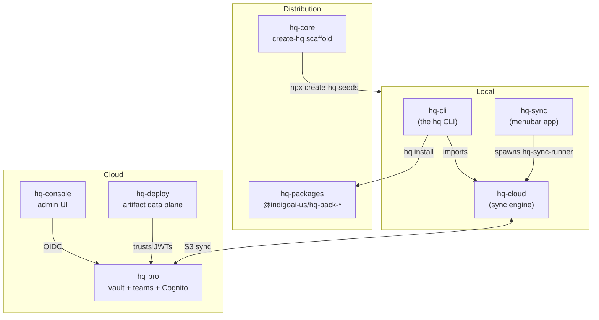

HQ is no longer a single combined repository. It is a set of independently versioned repos that compose through published npm packages, GitHub Releases, and one shared AWS Cognito identity. Each repo ships on its own cadence — a CLI release does not require touching the desktop app, and the cloud apps deploy independently of the scaffold.

## The repos at a glance

| Repo | Ships as | What it is |
|------|----------|------------|
| **hq-core** | `npx create-hq` scaffold | The starter kit / seed for a new HQ instance. Ships minimal; rich capabilities install as packs. |
| **hq-cli** | `@indigoai-us/hq-cli` | The `hq` CLI — module management and cloud sync, the operator's entry point. |
| **hq-cloud** | `@indigoai-us/hq-cloud` | The bidirectional S3 sync engine behind the CLI and the menubar app. |
| **hq-sync** | macOS app (GitHub Releases) | Tauri 2 menubar app — a friendly GUI over `hq sync` for non-technical users. |
| **hq-console** | Next.js app (`hq.getindigo.ai`) | Admin UI for HQ deployments, teams, and usage. |
| **hq-deploy** | AWS data plane | Serves deployed web artifacts on subdomains; deploy-management API. |
| **hq-pro** | SST app on AWS | The vault, team platform, and shared Cognito identity. |
| **hq-packages** | `@indigoai-us/hq-pack-*` | Content packs installed into an HQ instance via `hq install`. |

Each product has a dedicated page under [Products](/hq/products/hq-core/).

## How they compose

### Composition rules

- **The scaffold seeds, it does not run.** `hq-core` is copied once by `npx create-hq`. After that it has no runtime relationship to the other repos — upgrades flow through `/update-hq`, not a shared dependency.
- **The CLI owns sync; the engine does the work.** `hq-cli` depends on `@indigoai-us/hq-cloud` and lazily imports it only when a `hq sync` subcommand runs. `hq-cloud` ships a `hq-sync-runner` binary that emits ndjson sync events.
- **The menubar app is a GUI over the same engine.** `hq-sync` (Tauri 2) spawns `hq-sync-runner` and renders its progress events. It is distinct from the engine itself — see [hq-sync](/hq/products/hq-sync/) and [hq-cloud](/hq/products/hq-cloud/).
- **One identity, many apps.** `hq-pro` provisions the shared Cognito pool and the vault. `hq-console` authenticates against it (NextAuth/OIDC) and `hq-deploy` trusts JWTs minted by it — neither owns its own user store.
- **Capabilities install as packs.** Rich add-ons (design styles, Slack bots, etc.) live in `hq-packages` and install via `hq install @indigoai-us/hq-pack-*` — see [hq-packages](/hq/products/hq-packages/overview/).

## Versioning

There is no single shared version anymore. Each repo carries and releases its own:

| Repo | Current version | Release mechanism |
|------|-----------------|-------------------|
| hq-core | `hqVersion 12.x` (`core.yaml`) | `npx create-hq` pulls the latest scaffold |
| hq-cli | `@indigoai-us/hq-cli` 5.x | `npm publish` from its own repo |
| hq-cloud | `@indigoai-us/hq-cloud` 5.x | `npm publish` from its own repo |
| hq-sync | 0.1.x | `v*` git tag → signed/notarized DMG + `latest.json` auto-update |
| hq-console / hq-deploy / hq-pro | per-repo | Vercel / SST deploys |
| hq-packages | per-pack `version` in `package.yaml` | `npm publish` per pack |

> A package's `repository.url` may still point at the archived combined repo in older metadata — that is stale and not the source of truth. The split repos above are canonical.

## Where to go next

- [hq-cli deep dive](/hq/architecture/4-hq-cli/) — module management + sync bridge internals
- [hq-cloud deep dive](/hq/architecture/5-hq-cloud/) — the S3 sync engine
- [Module system](/hq/architecture/8-module-system/) — how external repos plug in
- [Products](/hq/products/hq-core/) — concise per-product pages
