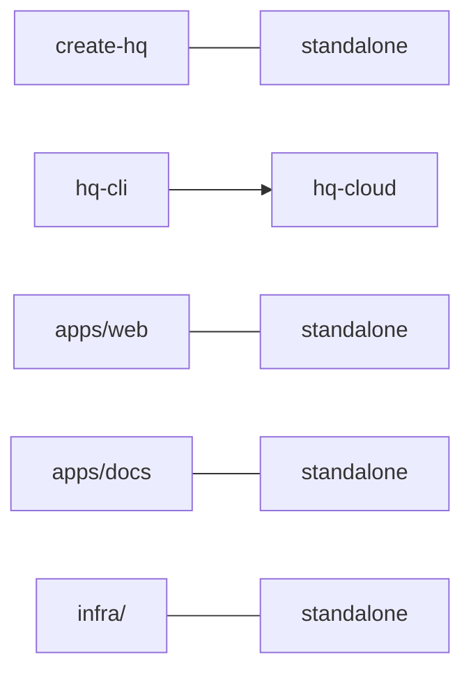

HQ ships as a single monorepo managed with npm workspaces. Every package, app, and infrastructure definition lives in one repository with unified versioning and shared TypeScript configuration.

## Root package.json

```json
{
  "name": "hq-monorepo",
  "private": true,
  "version": "5.0.0",
  "workspaces": ["packages/*", "apps/*"],
  "scripts": {
    "build": "npm run build --workspaces --if-present",
    "typecheck": "npm run typecheck --workspaces --if-present",
    "clean": "npm run clean --workspaces --if-present"
  },
  "engines": { "node": ">=18.0.0" }
}
```

The root is marked `private: true` so it is never published to npm. The `workspaces` field registers everything under `packages/` and `apps/` for dependency hoisting and cross-package linking.

## Directory Layout

```
hq/
├── packages/
│   ├── create-hq/      # npx create-hq installer
│   ├── hq-cli/         # @indigoai/hq-cli
│   └── hq-cloud/       # @indigoai/hq-cloud
├── apps/
│   ├── web/            # PWA dashboard
│   └── docs/           # This documentation site
├── infra/              # AWS SST infrastructure
├── template/           # HQ starter kit content
└── .github/workflows/  # CI/CD pipelines
```

| Path | Published As | Description |
|------|-------------|-------------|
| `packages/create-hq` | `create-hq` | Scaffolds a new HQ instance via `npx create-hq` |
| `packages/hq-cli` | `@indigoai/hq-cli` | CLI for running commands, workers, and sessions |
| `packages/hq-cloud` | `@indigoai/hq-cloud` | Cloud sync, auth, and remote storage client |
| `apps/web` | — | PWA dashboard (not published to npm) |
| `apps/docs` | — | Starlight documentation site (this site) |
| `infra/` | — | AWS SST infrastructure definitions |
| `template/` | — | Starter kit content copied by `create-hq` |

## Dependency Graph



`create-hq` is fully standalone so it can run via `npx` without pulling in the rest of the monorepo. `hq-cli` depends on `hq-cloud` for sync and auth. The apps and infrastructure have no cross-dependencies on the packages.

## Versioning

All packages share a single version number — currently **v5.0.0**. When a release is cut:

1. The root `package.json` version is bumped.
2. Each publishable package under `packages/` is updated to match.
3. A git tag (e.g. `v5.0.0`) is pushed.
4. CI detects the tag and runs `npm publish` for each package.

This unified versioning keeps the CLI and cloud library in lockstep, avoiding compatibility issues between packages.

## Scripts

Three workspace-wide scripts are defined at the root:

| Script | Command | Purpose |
|--------|---------|---------|
| `build` | `npm run build --workspaces --if-present` | Compile all packages and apps |
| `typecheck` | `npm run typecheck --workspaces --if-present` | Run `tsc --noEmit` across all workspaces |
| `clean` | `npm run clean --workspaces --if-present` | Remove build artifacts (`dist/`, `.next/`, etc.) |

The `--if-present` flag means workspaces that do not define a given script are silently skipped rather than causing an error.

## Shared TypeScript Configuration

A root `tsconfig.base.json` provides shared compiler settings that every package and app extends:

```json
{
  "compilerOptions": {
    "target": "ES2022",
    "module": "NodeNext",
    "moduleResolution": "NodeNext",
    "strict": true,
    "esModuleInterop": true,
    "skipLibCheck": true,
    "declaration": true,
    "declarationMap": true,
    "sourceMap": true,
    "outDir": "dist"
  }
}
```

Key choices:

- **ES2022** target enables top-level `await`, `structuredClone`, and modern built-ins without polyfills.
- **NodeNext** module resolution aligns with Node.js ESM conventions (explicit `.js` extensions in imports, `package.json` `exports` field).
- **Strict mode** is enforced globally — no implicit `any`, no unchecked index access.

Each workspace extends this base and adds its own `include`/`exclude` paths:

```json
{
  "extends": "../../tsconfig.base.json",
  "compilerOptions": {
    "outDir": "dist",
    "rootDir": "src"
  },
  "include": ["src"]
}
```
