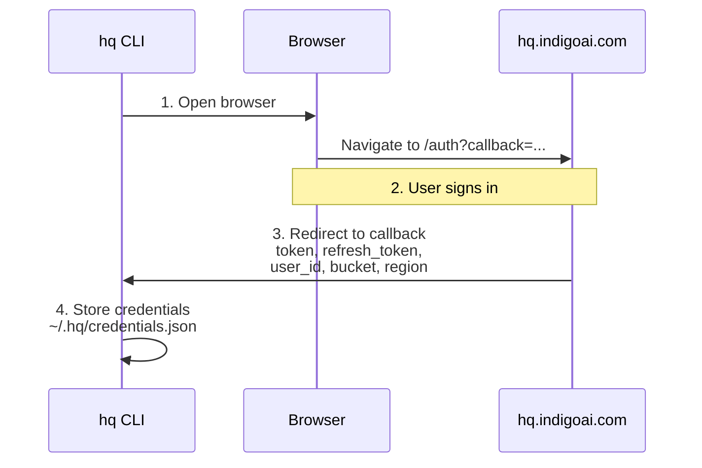
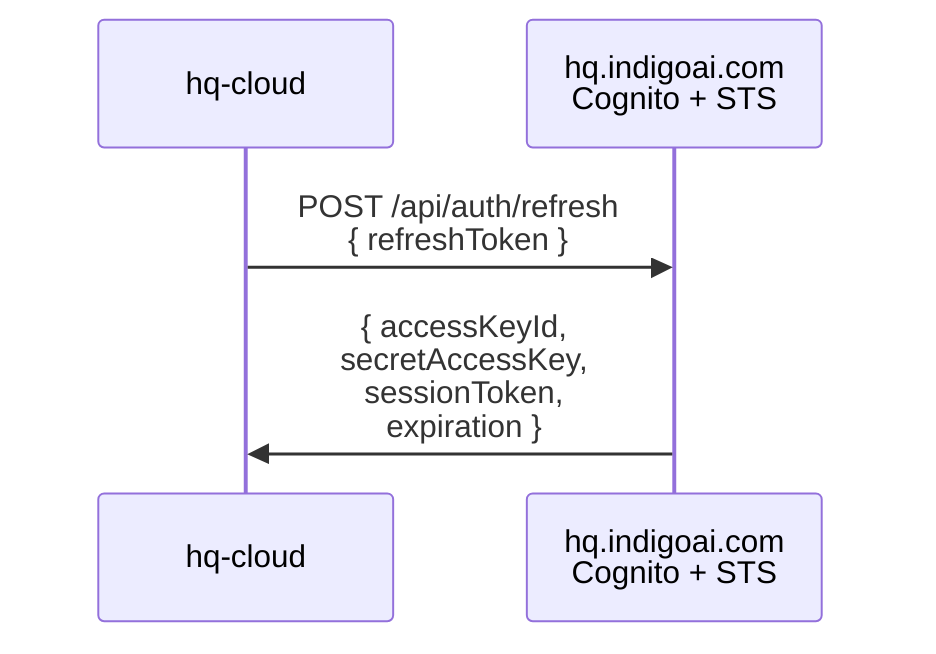
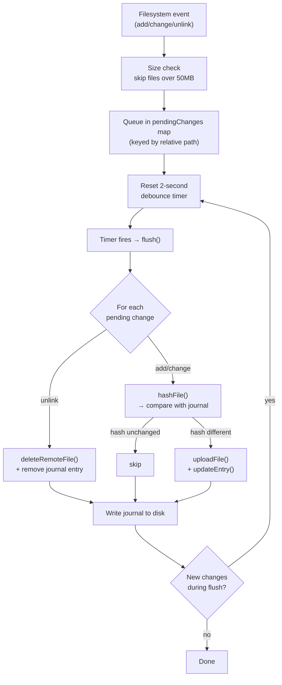
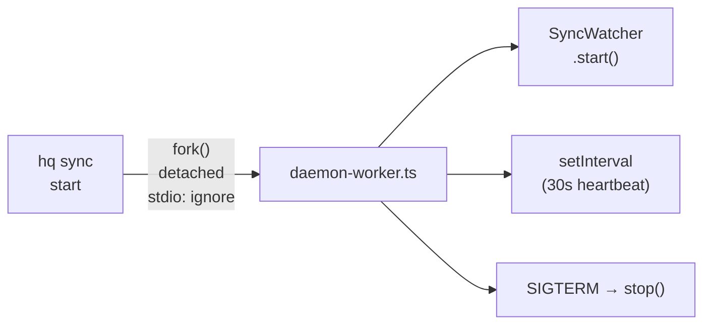
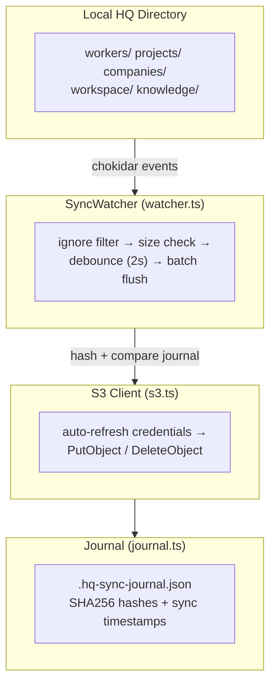

`@indigoai/hq-cloud` is the most complex package in the HQ monorepo. It handles authentication with IndigoAI, bidirectional file synchronization to S3, background daemon management, file change detection, and conflict resolution via a local journal. The CLI delegates all sync operations to this package.

## Source Layout

```
packages/hq-cloud/src/
├── types.ts          # Shared type definitions
├── auth.ts           # OAuth flow + credential management
├── s3.ts             # AWS SDK v3 operations (upload, download, list, delete)
├── watcher.ts        # Chokidar-based file change detection
├── journal.ts        # Sync state tracking with SHA256 hashing
├── daemon.ts         # Background process lifecycle management
├── daemon-worker.ts  # Detached child process entry point
├── ignore.ts         # Path filtering (gitignore-compatible)
└── index.ts          # Public API surface
```

## Dependencies

| Package | Purpose |
|---------|---------|
| `@aws-sdk/client-s3` | S3 PutObject, GetObject, ListObjectsV2, DeleteObject |
| `@aws-sdk/client-cognito-identity` | Cognito identity pool integration |
| `@aws-sdk/credential-providers` | STS temporary credential resolution |
| `chokidar` | Cross-platform filesystem watcher |
| `ignore` | Gitignore-compatible pattern matching |
| `open` | Opens browser for OAuth flow |

## Types

All shared types live in `types.ts`. These are the data structures that flow between every other module in the package.

### SyncConfig

Resolved configuration for S3 operations. Built from stored credentials at the point of use rather than stored directly.

```typescript
interface SyncConfig {
  bucket: string;
  region: string;
  userId: string;
  prefix: string; // e.g. "hq/"
}
```

The `prefix` field scopes all S3 keys under a user-specific namespace. Every remote key follows the pattern `hq/{relativePath}`, where `relativePath` is the file's path relative to the HQ root directory.

### Credentials

Stored at `~/.hq/credentials.json` with file mode `0o600` (owner read/write only). Contains both the long-lived refresh token and the short-lived AWS STS credentials.

```typescript
interface Credentials {
  accessKeyId: string;
  secretAccessKey: string;
  sessionToken?: string;
  expiration?: string;
  refreshToken: string;
  userId: string;
  bucket: string;
  region: string;
}
```

After the initial OAuth flow, `accessKeyId` and `secretAccessKey` are empty strings. They are populated on the first S3 operation when `refreshAwsCredentials()` is called to exchange the refresh token for temporary STS credentials.

### JournalEntry

One entry per synced file. Stored in the journal's `files` record, keyed by relative path.

```typescript
interface JournalEntry {
  hash: string;       // SHA256 hex digest of file contents
  size: number;       // File size in bytes
  syncedAt: string;   // ISO 8601 timestamp of last sync
  direction: "up" | "down";  // Last sync direction
}
```

### SyncJournal

The full journal structure, persisted to `.hq-sync-journal.json` at the HQ root.

```typescript
interface SyncJournal {
  version: "1";
  lastSync: string;
  files: Record<string, JournalEntry>;
}
```

The `version` field is a string `"1"` (not a number) to allow future schema migrations. The `files` record is keyed by relative path from HQ root.

### SyncStatus, PushResult, PullResult

Return types for the public API methods.

```typescript
interface SyncStatus {
  running: boolean;
  lastSync: string | null;
  fileCount: number;
  bucket: string | null;
  errors: string[];
}

interface PushResult {
  filesUploaded: number;
  bytesUploaded: number;
}

interface PullResult {
  filesDownloaded: number;
  bytesDownloaded: number;
}
```

### DaemonState

Written to `.hq-sync-daemon.json` alongside the PID file. Provides metadata about the running daemon process.

```typescript
interface DaemonState {
  pid: number;
  startedAt: string;
  hqRoot: string;
}
```

## Auth (auth.ts)

Authentication uses an OAuth flow with `hq.indigoai.com`. The flow mints a refresh token locally, which is then exchanged for temporary AWS STS credentials on demand.

### OAuth Flow



1. `authenticate()` starts an HTTP server on `localhost:19847`.
2. The user's browser opens to `https://hq.indigoai.com/auth?callback=http://localhost:19847/callback`.
3. After sign-in, IndigoAI redirects to the callback URL with query parameters: `token`, `refresh_token`, `user_id`, `bucket`, and `region`.
4. The callback handler writes credentials to `~/.hq/credentials.json` with mode `0o600`, then closes the server.

The flow has a 5-minute timeout. If the browser does not complete authentication within that window, the promise rejects and the localhost server shuts down.

### Credential Refresh



`refreshAwsCredentials()` sends the stored refresh token to `/api/auth/refresh`, which validates it against Cognito and returns temporary STS credentials. The updated credentials (including `accessKeyId`, `secretAccessKey`, `sessionToken`, and `expiration`) are merged into the stored credentials file.

The S3 client checks for expired credentials before every operation. If `accessKeyId` is missing or `expiration` is in the past, a refresh is triggered automatically.

### Helper Functions

| Function | Purpose |
|----------|---------|
| `hasCredentials()` | Returns `true` if `~/.hq/credentials.json` exists |
| `readCredentials()` | Parses and returns stored credentials, or `null` |
| `writeCredentials(creds)` | Writes credentials with `0o600` permissions |
| `clearCredentials()` | Deletes the credentials file |
| `authenticate()` | Runs the full OAuth flow |
| `refreshAwsCredentials(creds)` | Exchanges refresh token for STS credentials |

## S3 (s3.ts)

All S3 operations use AWS SDK v3 (`@aws-sdk/client-s3`). The module maintains a singleton `S3Client` instance that is lazily initialized and reuses connections.

### Client Initialization

```typescript
async function getClient(): Promise<{ client: S3Client; config: SyncConfig }>
```

`getClient()` is called before every S3 operation. It:

1. Reads credentials from `~/.hq/credentials.json`.
2. Checks if `accessKeyId` is missing or `expiration` has passed.
3. If expired, calls `refreshAwsCredentials()` to get fresh STS credentials.
4. Creates or reuses the singleton `S3Client`.
5. Returns the client and a `SyncConfig` derived from the credentials.

### Key Namespace

All S3 keys are prefixed with `hq/` followed by the file's relative path within the HQ directory:

```
hq/workers/registry.yaml
hq/projects/my-project/prd.json
hq/companies/acme/knowledge/brand.md
```

This keeps all HQ content under a single prefix in the user's bucket, making it easy to list, backup, or delete.

### Operations

**uploadFile(localPath, relativePath)** — Reads the file into memory, determines MIME type from extension, sends a `PutObjectCommand`.

**downloadFile(relativePath, localPath)** — Sends a `GetObjectCommand`, streams the response body into chunks, concatenates, and writes to disk. Creates parent directories if they do not exist.

**listRemoteFiles()** — Paginates through `ListObjectsV2Command` responses using `ContinuationToken`. Returns an array of `RemoteFile` objects with key, relative path, size, last modified date, and ETag.

**deleteRemoteFile(relativePath)** — Sends a `DeleteObjectCommand` for the prefixed key.

### MIME Type Mapping

The module maps file extensions to MIME types for the `ContentType` header on upload:

| Extension | MIME Type |
|-----------|-----------|
| `.md` | `text/markdown` |
| `.json` | `application/json` |
| `.yaml`, `.yml` | `text/yaml` |
| `.ts` | `text/typescript` |
| `.js` | `text/javascript` |
| `.txt` | `text/plain` |
| `.html` | `text/html` |
| `.css` | `text/css` |
| `.png` | `image/png` |
| `.jpg`, `.jpeg` | `image/jpeg` |
| `.svg` | `image/svg+xml` |
| `.pdf` | `application/pdf` |
| (other) | `application/octet-stream` |

## Watcher (watcher.ts)

The `SyncWatcher` class monitors the HQ directory for filesystem changes and syncs them to S3 in batched, debounced flushes.

### Configuration

- **chokidar** with `persistent: true`, `ignoreInitial: true` (does not upload existing files on start)
- **awaitWriteFinish**: `stabilityThreshold: 500ms`, `pollInterval: 100ms` — waits for writes to complete before firing events
- **Debounce**: 2-second quiet period before flushing the batch

### Change Pipeline



### Error Handling

Failed changes are re-queued into `pendingChanges` for automatic retry on the next flush cycle. The `processing` flag prevents concurrent flushes.

### Key Design Decisions

- **Map-based deduplication**: Multiple rapid changes to the same file collapse into a single sync operation. Only the latest change type is retained.
- **Debounce, not throttle**: The timer resets on every new change, ensuring bulk operations (like `git checkout`) settle before syncing starts.
- **Non-blocking**: The watcher runs in a detached child process, so filesystem events never block the CLI.

## Journal (journal.ts)

The journal is the source of truth for what has been synced. It lives at `.hq-sync-journal.json` in the HQ root directory.

### Hash-Based Conflict Detection

Every file's contents are hashed with SHA256 before sync. The journal stores the hash of the last-synced version. On the next change event:

1. Compute the current file's SHA256 hash.
2. Compare with the journal entry's `hash` field.
3. If identical, skip the upload (file was modified and reverted, or a no-op save).
4. If different, upload and update the journal.

This prevents redundant uploads when editors trigger save events without actual content changes.

### Journal Structure on Disk

```json
{
  "version": "1",
  "lastSync": "2026-01-15T10:30:00.000Z",
  "files": {
    "workers/registry.yaml": {
      "hash": "a1b2c3d4e5f6...",
      "size": 1234,
      "syncedAt": "2026-01-15T10:30:00.000Z",
      "direction": "up"
    },
    "projects/my-project/prd.json": {
      "hash": "f6e5d4c3b2a1...",
      "size": 5678,
      "syncedAt": "2026-01-15T10:29:50.000Z",
      "direction": "down"
    }
  }
}
```

### Functions

| Function | Purpose |
|----------|---------|
| `getJournalPath(hqRoot)` | Returns absolute path to `.hq-sync-journal.json` |
| `readJournal(hqRoot)` | Reads and parses journal, returns empty journal if missing |
| `writeJournal(hqRoot, journal)` | Serializes and writes journal to disk |
| `hashFile(filePath)` | Returns SHA256 hex digest of a file's contents |
| `updateEntry(journal, path, hash, size, dir)` | Updates or creates a journal entry and sets `lastSync` |
| `getEntry(journal, path)` | Looks up a single entry by relative path |
| `removeEntry(journal, path)` | Deletes an entry from the journal |

## Daemon (daemon.ts)

The sync daemon runs as a detached child process so it survives after the CLI command exits. It manages the `SyncWatcher` lifecycle in the background.

### Process Model



`startDaemon()` uses `child_process.fork()` with `detached: true` and `stdio: "ignore"`. The child is immediately `unref()`'d so the parent CLI can exit without waiting for it.

### State Files

Two files track the daemon's state:

| File | Contents | Purpose |
|------|----------|---------|
| `.hq-sync.pid` | Process ID (plain text) | Used by `isDaemonRunning()` to check if process exists |
| `.hq-sync-daemon.json` | `DaemonState` JSON | Metadata: PID, start time, HQ root path |

Both files are written on start and cleaned up on stop.

### Lifecycle Functions

**`isDaemonRunning(hqRoot)`** — Reads the PID file, sends signal `0` via `process.kill(pid, 0)`. Signal 0 does not kill the process; it only checks whether the process exists. If the process is gone, the stale PID file is cleaned up and `false` is returned.

**`startDaemon(hqRoot)`** — Checks if already running, forks `daemon-worker.js` as a detached child, writes PID and state files.

**`stopDaemon(hqRoot)`** — Reads the PID file, sends `SIGTERM`, then removes both the PID file and the state file.

**`getDaemonState(hqRoot)`** — Reads and parses `.hq-sync-daemon.json`, returns `null` if missing or unparseable.

### daemon-worker.ts

The worker entry point is minimal:

1. Reads `hqRoot` from `process.argv[2]`.
2. Creates and starts a `SyncWatcher` instance.
3. Registers `SIGTERM` and `SIGINT` handlers for graceful shutdown (calls `watcher.stop()` then exits).
4. Runs a 30-second `setInterval` heartbeat to keep the Node.js event loop alive. This interval is also a future hook point for polling remote changes.

## Ignore (ignore.ts)

Path filtering determines which files are synced and which are skipped. The module uses the `ignore` npm package, which implements the same glob syntax as `.gitignore`.

### Default Ignore Patterns

These patterns are always applied, regardless of `.hqsyncignore` content:

```
.git/
.git
node_modules/
dist/
.DS_Store
Thumbs.db
*.pid
.hq-sync.pid
.hq-sync-journal.json
.hq-sync-state.json
modules.lock
repos/
.env
.env.*
```

Notable entries:

- **`repos/`** — Source code repositories are excluded from sync because they have their own version control. Only HQ metadata (workers, projects, knowledge, workspace) is synced.
- **`.env` / `.env.*`** — Environment files with secrets are never synced.
- **Sync artifacts** — The PID file, journal, and state file are excluded to prevent sync loops.

### Custom Patterns

Users can create `.hqsyncignore` in the HQ root to add additional patterns using standard gitignore syntax:

```
# Ignore large data exports
companies/*/data/exports/
# Ignore local scratch files
workspace/scratch/
```

### Size Limit

`isWithinSizeLimit()` enforces a 50MB maximum file size. Files exceeding this limit are silently skipped during both watcher events and bulk push operations. The limit is configurable via the `maxBytes` parameter (default: `50 * 1024 * 1024`).

## Public API (index.ts)

The public API surface is intentionally small. The CLI imports only these functions:

### initSync(hqRoot)

Runs the OAuth flow if not already authenticated. If credentials exist, prints a message and returns immediately.

```typescript
export async function initSync(hqRoot: string): Promise<void>
```

### startDaemon(hqRoot) / stopDaemon(hqRoot)

Start or stop the background sync daemon. `startDaemon()` throws if not authenticated.

```typescript
export async function startDaemon(hqRoot: string): Promise<void>
export async function stopDaemon(hqRoot: string): Promise<void>
```

### getStatus(hqRoot)

Returns current sync health: whether the daemon is running, last sync time, file count from the journal, bucket name, and any errors.

```typescript
export async function getStatus(hqRoot: string): Promise<SyncStatus>
```

### pushAll(hqRoot)

Force-uploads all local files (respecting ignore patterns and size limits) to S3. Walks the directory tree, hashes each file, uploads, and updates the journal. Returns a count of files and bytes uploaded.

```typescript
export async function pushAll(hqRoot: string): Promise<PushResult>
```

### pullAll(hqRoot)

Force-downloads all remote files from S3 to the local HQ directory. Lists all remote objects under the user's prefix, downloads each one, hashes the result, and updates the journal. Creates directories as needed.

```typescript
export async function pullAll(hqRoot: string): Promise<PullResult>
```

### Internal: walkDir

A recursive directory walker that respects the ignore filter. Not exported but used by `pushAll()` to enumerate syncable files.

```typescript
function walkDir(
  dir: string,
  root: string,
  filter: (p: string) => boolean
): { absolutePath: string; relativePath: string }[]
```

## Data Flow Summary

Putting it all together, here is how data flows through the system during normal operation:



The daemon worker keeps this pipeline alive as a background process, while the CLI's `pushAll()` and `pullAll()` functions bypass the watcher and operate directly on the S3 client and journal.

## Conflict Resolution

The current implementation uses a **last-write-wins** strategy:

- **Upload**: If the local file hash differs from the journal, upload overwrites the remote copy.
- **Download** (via `pullAll`): Remote files overwrite local copies unconditionally.
- **No merge**: There is no three-way merge or diff. The journal tracks which direction the last sync went (`"up"` or `"down"`), providing an audit trail but not preventing overwrites.

This is sufficient for the primary use case where a single user syncs between their workstation and mobile/web access. Multi-device concurrent editing would require a more sophisticated conflict resolution mechanism.

## Security Model

- **Credentials file**: Written with `0o600` (owner read/write only) to prevent other users on the system from reading AWS credentials.
- **STS temporary credentials**: Short-lived (`expiration` field). Even if leaked, they expire and cannot be refreshed without the refresh token.
- **Refresh token**: Stored alongside credentials. Exchanged server-side for new STS credentials via Cognito.
- **No secrets in sync**: `.env` and `.env.*` files are in the default ignore list. Credentials are stored in `~/.hq/`, not in the HQ directory.
- **Scoped bucket access**: Each user gets their own prefix within the bucket, enforced by IAM policy on the STS credentials.
