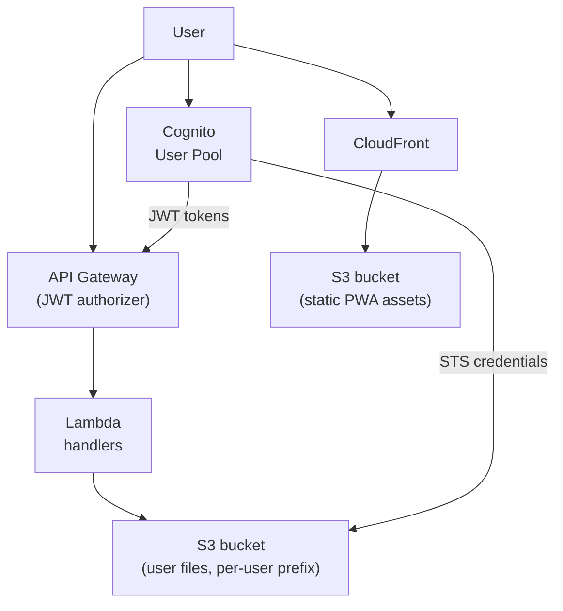

HQ Cloud runs on AWS, defined entirely with [SST (Serverless Stack)](https://sst.dev). The infrastructure config at `infra/sst.config.ts` provisions four resources: a Cognito user pool for authentication, an S3 bucket for file storage, an API Gateway for CRUD operations, and a CloudFront distribution for the web dashboard.



## Cognito User Pool

Authentication uses Amazon Cognito with email-based sign-up and sign-in.

```ts
const userPool = new cognito.UserPool(stack, "UserPool", {
  selfSignUpEnabled: true,
  autoVerify: { email: true },
  signInAliases: { email: true },
});

const userPoolClient = new cognito.UserPoolClient(stack, "UserPoolClient", {
  userPool,
});
```

Key settings:

- **Self-signup enabled** — users register directly without admin invitation.
- **Auto-verify email** — Cognito sends a verification code on sign-up and confirms the email automatically.
- **Email as sign-in alias** — users authenticate with their email address, not a separate username.

The `UserPoolClient` is used by both the web PWA and the CLI for token-based authentication flows.

## S3 Bucket

A single S3 bucket stores all user files with per-user prefix isolation.

```ts
const bucket = new s3.Bucket(stack, "Uploads", {
  cors: [
    {
      allowedOrigins: ["https://hq.indigoai.com", "http://localhost:5173"],
      allowedMethods: [s3.HttpMethods.GET, s3.HttpMethods.PUT, s3.HttpMethods.DELETE],
      allowedHeaders: ["*"],
    },
  ],
});
```

### Storage layout

Each authenticated user gets an isolated prefix within the bucket:

```
s3://hq-bucket/
└── users/
    ├── {userId-1}/hq/
    │   ├── CLAUDE.md
    │   ├── workers/registry.yaml
    │   └── ...
    ├── {userId-2}/hq/
    │   └── ...
    └── ...
```

The `users/{userId}/hq/` prefix mirrors the local HQ directory structure. All file operations are scoped to the authenticated user's prefix, preventing cross-user access.

CORS is restricted to the production domain (`hq.indigoai.com`) and the local dev server (`localhost:5173`).

## API Gateway

An HTTP API (API Gateway v2) exposes six routes, all protected by a JWT authorizer backed by the Cognito user pool.

### Routes

| Method | Path | Handler | Purpose |
|--------|------|---------|---------|
| `GET` | `/api/files` | `files.list` | List files (paginated, 100 keys per page) |
| `GET` | `/api/files/{path+}` | `files.get` | Get file content |
| `PUT` | `/api/files/{path+}` | `files.put` | Upload file |
| `DELETE` | `/api/files/{path+}` | `files.remove` | Delete file |
| `POST` | `/api/auth/refresh` | `auth.refresh` | Refresh Cognito tokens, get STS credentials |
| `GET` | `/api/auth/credentials` | `auth.getCredentials` | Get user's bucket, region, prefix |

The `{path+}` parameter is a greedy path match, allowing nested file paths like `/api/files/workers/registry.yaml`.

### JWT Authorizer

Every route uses a JWT authorizer that validates tokens issued by the Cognito user pool. The authorizer extracts the `sub` claim from the JWT to identify the authenticated user.

### File handlers (files.ts)

All file operations extract the user ID from the JWT and construct an S3 key scoped to that user's prefix:

```ts
const userId = event.requestContext.authorizer.jwt.claims.sub;
const key = `users/${userId}/hq/${path}`;
```

| Handler | S3 Operation | Notes |
|---------|-------------|-------|
| `list` | `ListObjectsV2` | Supports pagination token, strips user prefix from returned keys |
| `get` | `GetObject` | Returns base64-encoded body and content type |
| `put` | `PutObject` | Accepts base64-encoded body |
| `remove` | `DeleteObject` | Deletes a single object |

The `list` handler returns up to 100 keys per page. When more results exist, a continuation token is returned for the next page. Key names are returned with the user prefix stripped so the client sees paths relative to their HQ root.

### Auth handlers (auth.ts)

| Handler | Flow | Notes |
|---------|------|-------|
| `refresh` | `InitiateAuth` (REFRESH_TOKEN_AUTH) | Exchanges refresh token for new access/ID tokens, then calls `AssumeRole` for STS temporary credentials (1-hour expiry) |
| `getCredentials` | — | Returns the user's `userId`, bucket name, region, and S3 prefix |

The `refresh` handler performs two operations: first it refreshes the Cognito tokens, then it assumes an IAM role to generate temporary STS credentials. These credentials have a scoped S3 policy that only permits access to the user's prefix, and they expire after one hour.

## Static Site

The web dashboard is deployed as a static site behind CloudFront:

```ts
new StaticSite(stack, "Web", {
  path: "apps/web",
  customDomain: "hq.indigoai.com",
});
```

CloudFront serves the built PWA assets and handles TLS termination for the custom domain.

## Security Model

The infrastructure enforces isolation at multiple layers:

1. **JWT verification** — All API routes require a valid Cognito JWT. Unauthenticated requests are rejected at the API Gateway level before reaching any Lambda.
2. **User prefix scoping** — Every Lambda handler extracts the `sub` claim from the JWT and constructs S3 keys under `users/{userId}/hq/`. There is no API path that allows accessing another user's prefix.
3. **STS temporary credentials** — The `refresh` endpoint issues short-lived (1-hour) AWS credentials with an IAM policy scoped to the user's S3 prefix. Even if credentials leak, they only grant access to that user's files and expire quickly.
4. **CORS restriction** — The S3 bucket and API only accept requests from `hq.indigoai.com` and `localhost:5173`, blocking cross-origin access from other domains.
