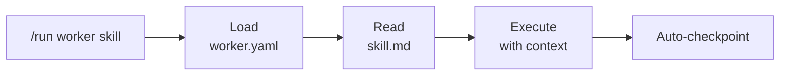
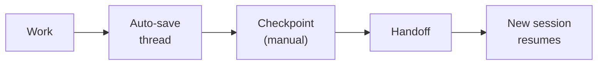

## Workers

Workers are AI agents with specific skills. Each worker has:

- **worker.yaml** — Configuration (type, skills, context, execution rules)
- **skills/** — Markdown files describing what the worker can do
- **src/** — Optional TypeScript source for MCP server integration

Workers are invoked with `/run {worker-id} {skill}`.



**Types:** CodeWorker, ContentWorker, SocialWorker, ResearchWorker, OpsWorker, Library

## Knowledge Bases

Persistent memory stored as markdown and structured files. Knowledge bases are **git repos symlinked into HQ**, enabling independent versioning.

```
knowledge/
├── Ralph/              # Coding methodology
├── workers/            # Worker framework docs
├── hq-core/            # Thread schema, checkpoints
├── ai-security/        # Security practices
├── design-styles/      # Image generation guides
├── dev-team/           # Dev team patterns
├── loom/               # Agent patterns (reference)
└── projects/           # Project templates
```

Each knowledge base can be its own git repo, cloned into `repos/public/` or `repos/private/` and symlinked.

## Commands

Slash commands orchestrate workflows. Run them inside Claude Code with `/command-name`.

**Categories:**
- **Session** — `/checkpoint`, `/handoff`, `/reanchor`, `/nexttask`, `/remember`, `/learn`
- **Workers** — `/run`, `/newworker`, `/metrics`
- **Projects** — `/prd`, `/run-project`, `/execute-task`
- **System** — `/search`, `/search-reindex`, `/cleanup`, `/setup`, `/exit-plan`

## Checkpoints & Threads

HQ automatically saves session state so work survives context limits.

- **Threads** (`workspace/threads/`) — Auto-saved session summaries with git state
- **Checkpoints** (`workspace/checkpoints/`) — Manual saves via `/checkpoint`
- **Auto-handoff** — When context reaches 70% capacity, HQ automatically runs `/handoff`



## Workspace

The `workspace/` directory is the runtime workspace:

| Directory | Purpose |
|-----------|---------|
| `threads/` | Auto-saved session state (JSON) |
| `checkpoints/` | Manual saves via `/checkpoint` |
| `learnings/` | Captured insights from task execution |
| `orchestrator/` | Project execution state |
| `reports/` | Generated reports |
| `social-drafts/` | Content pipeline drafts |

## INDEX.md System

Hierarchical navigation maps throughout HQ. Each major directory has an `INDEX.md` providing a directory map, recent changes, and links.

- Auto-updated by commands (`/checkpoint`, `/handoff`, `/prd`, `/newworker`)
- Rebuild all with `/cleanup --reindex`

## Search (qmd)

HQ is indexed with [qmd](https://github.com/tobi/qmd) for local semantic and full-text search.

```bash
qmd search "stripe integration"     # BM25 keyword search
qmd vsearch "how to deploy"         # Semantic search
qmd query "best practices"          # Hybrid (best quality)
```

Or use the built-in command: `/search "your query"`

## Learning System

HQ learns from task execution:

- `/learn` — Auto-captures insights after tasks
- `/remember` — Manual rule injection
- Rules are injected directly into source files (worker.yaml, command .md, CLAUDE.md)
- Max 20 global rules, deduplicated, event log at `workspace/learnings/`
