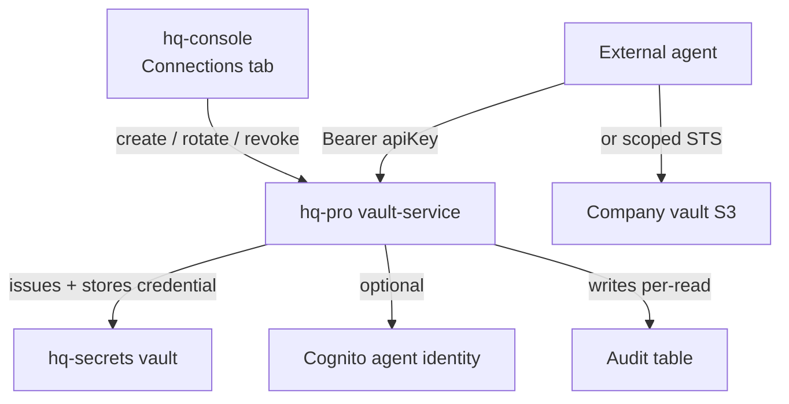

> **External Connections is a managed surface in [hq-console](/hq/products/hq-console/), backed by the [hq-pro](/hq/products/hq-pro/about/) vault.** It replaces ad-hoc credential hand-vending with a lifecycle object — create, list, rotate, revoke, audit.

**External Connections** is how your AI-forward services read your company's HQ vault. Open the **Connections** tab in any company in the console, name a connection, allowlist the prefixes it can see, choose an auth mechanism, and hand the issued credential to your agent. The agent reads only the prefixes you grant; every other path returns `403`; writes are never permitted.

## When to use it

- **Your own agents** — Python+TypeScript runners, coding assistants, customer-facing copilots — need to read your team's knowledge without holding a full human seat or going through Google SSO.
- **Service-to-service reads** — a scheduled job, a webhook handler, a serverless function that needs file-level access to a specific prefix.
- **Demos and trials** — granting a partner read access to a single prefix for a fixed scope, then revoking the key without touching their account.

For one-off recipient grants to a known person, prefer [hq-share](/hq/products/capabilities/hq-share/). External Connections is for **services and agents**, not humans.

## Where to find it

`https://hq.{your-domain}.com/companies/{slug}/connections` — sits in the per-company nav next to **Vault**, **Secrets**, **Fleet**, **Groups**, and **Settings**. Owner and admin only.

## Create a connection

The create wizard has four fields:

1. **Name** — what this connection is for. Surfaces in the list view, audit events, and revoke confirmation.
2. **Allowed prefixes** — an allowlist of patterns the connection can read. Type a pattern, press **Enter** (or click **Add**), and it becomes a removable chip. A row of one-click **Quick-add suggestions** sits beneath the input with the standard HQ vault prefixes — `*` (everything), `knowledge/*`, `projects/*`, `workers/*`, `skills/*`. `knowledge/*` is pre-added on mount as a safe default; remove it if you want a different scope. At least one pattern is required.
   - Wildcards: trailing `*` matches anything under the prefix. A bare `knowledge/` is auto-normalized to `knowledge/*`. The lone `*` grants the whole company vault.
   - Validation rejects `..`, leading `/`, non-ASCII characters, and mid-string `*`.
3. **Permission** — always **read** in v1, shown read-only. Read-write is a fast-follow.
4. **Auth mechanism** — pick one (see below).

On submit, the credential is **revealed exactly once** with a copy-paste snippet (a `fetch` + `Authorization` header for API keys, an AWS SDK STS example for agent identities). After dismiss, the value is gone — only a hashed reference persists on the connection record. If a credential is lost, **rotate** to mint a new one.

## Two auth mechanisms — both read-only

| Mechanism | When to use it |
|---|---|
| **API key** | The default. A long-lived bearer credential (`hqxc_…`) sent on every request. Best for in-house runners, scripts, scheduled jobs, and any service you control end-to-end. |
| **Agent identity** | An `agent_`-prefixed Cognito identity with a non-interactive client-credentials grant. Vends short-lived AWS STS credentials at request time. Best for services already speaking the AWS SDK or running inside AWS. |

## The agent side — five lines

Two endpoints, no SDK, no runtime. Drop into anything that can issue an HTTP request.

```ts
const BASE = "https://hqapi.{your-domain}.com";
const KEY  = process.env.HQ_CONNECTION_KEY!;            // hqxc_…
const h    = { Authorization: `Bearer ${KEY}` };

const { objects } = await fetch(`${BASE}/v1/connections/files?path=knowledge/`,                                   { headers: h }).then(r => r.json());
const text      = await fetch(`${BASE}/v1/connections/files/object?path=${encodeURIComponent(objects[0].key)}`, { headers: h }).then(r => r.text());
```

For the `agentCognito` mechanism, the create-wizard snippet shows the equivalent AWS SDK STS-vend flow.

## Guarantees

| Guarantee | What it means in practice |
|---|---|
| **Read-only** | Connections cannot write, cannot delete, cannot mutate. Non-GET attempts are rejected at the edge. |
| **Prefix-scoped** | The connection sees only the patterns in its allowlist. Any path outside the grant returns `403`. |
| **Company-isolated** | The connection's company is bound to the credential, not the request. A key minted for company A can never reach company B's vault. |
| **Reveal-once** | The credential value is shown exactly once on creation; the record stores only a SHA-256 reference. |
| **Auditable** | Every successful read writes a per-connection audit event with timestamp, prefix, and source IP. Viewable inline next to the connection. |
| **Revocable** | Revoke disables the credential immediately. The next read returns `403`; the audit log remains. |

## Rotate, revoke, audit

Each row in the connections list has three inline actions, owner/admin only:

- **Rotate** — re-issues the credential with a new value (same connection id), reveals it exactly once, and invalidates the old value at the next read.
- **Revoke** — confirms first, then removes the vault secret, disables the agent identity (if applicable), and sets the status to `revoked`. Subsequent reads with the credential return `403`.
- **Audit** — expands a per-connection view of access events (timestamp, prefix, result, request id, source IP), backed by the existing CloudTrail + DynamoDB audit surface.

## How it relates to the rest of the ecosystem



- The credential value lives in the **hq-secrets** company vault (an SSM SecureString under `/hq/{companyId}/secrets/EXT_CONN/…`), manageable through [hq-secrets](/hq/products/capabilities/hq-secrets/).
- Only a SHA-256 reference is persisted on the connection record. Validation at the read seam hashes the presented key and compares against the indexed reference — there is no plaintext to leak.
- Prefix scoping reuses the same `validatePrefix` logic the vault-service uses everywhere else; STS vending reuses the existing scoped read-only path.

## Operational notes

- The feature is per-company, gated by a server-side flag. Enabled for every company by default; can be disabled per environment.
- All admin actions require an owner or admin role on the target company. A non-admin landing on `/companies/{slug}/connections` gets a `404`.
- The audit table has a 90-day TTL. Long-term retention should be exported to your own analytics pipeline.

## Limits

- **Read-only** only in v1. Read-write is a fast-follow.
- **Long-lived** credentials by design — there is no built-in expiry. Use rotate on your own cadence and revoke at offboarding.
- **No bulk import** of allowlist patterns yet — patterns are entered one at a time in the wizard (vault suggestions cover the common case).
