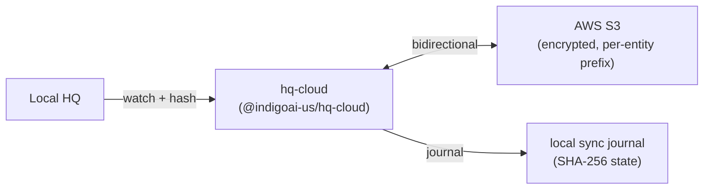

**hq-cloud** is the sync engine of the HQ ecosystem, published to npm as **`@indigoai-us/hq-cloud`** (currently **5.x**). It does the actual work of keeping a local HQ instance synchronized with cloud storage.

## What it is

- *"HQ by Indigo cloud sync engine — bidirectional S3 sync for mobile access."*
- A library plus a runner binary, `hq-sync-runner`, that emits ndjson sync events.
- Built on ESM + TypeScript with AWS SDK v3 (S3, Cognito), chokidar for file-change detection, and a local journal with SHA-256 hashing for conflict detection.

## Who uses it / when

You rarely invoke hq-cloud directly — it's consumed by other surfaces:

- The [`hq` CLI](/hq/products/hq-cli/) imports it for `hq sync` commands.
- The [hq-sync](/hq/products/hq-sync/) menubar app spawns its `hq-sync-runner` and renders the progress events.

## What it does

- **Auth** against the shared Cognito identity.
- **Bidirectional file sync** to S3 with per-entity prefixes.
- **Change detection** via chokidar, with gitignore-compatible path filtering.
- **Conflict resolution** via a local journal that tracks per-file sync state.

## Composition

hq-cloud is the single sync implementation in the ecosystem — both the CLI and the desktop app drive it rather than re-implementing sync. The cloud storage and identity it talks to are provisioned by [hq-pro](/hq/products/hq-pro/about/).

## Related

- [hq-cloud architecture](/hq/architecture/5-hq-cloud/) — engine internals (journal, watcher, daemon)
- [hq-cli](/hq/products/hq-cli/) — `hq sync` command surface
- [hq-sync](/hq/products/hq-sync/) — the menubar GUI over this engine
