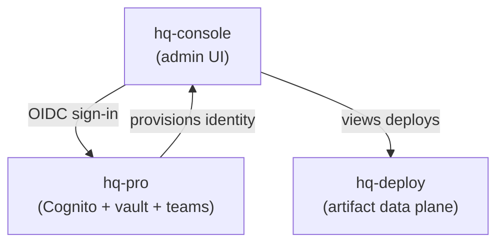

**hq-console** is the HQ admin surface: a Next.js web app where administrators manage HQ Cloud deployments, teams, and usage. It is deployed to Vercel (e.g. `hq.getindigo.ai`).

## What it is

- A **Next.js 15 / React 19** application styled with Tailwind v4.
- Authenticated with **NextAuth v5** via OIDC against the shared AWS Cognito identity pool (the same pool provisioned by [hq-pro](/hq/products/hq-pro/about/)) — the console does **not** run its own user store.
- Uses AWS SDK v3 (Cognito, S3, Secrets Manager, STS) and recharts for usage visualizations.

## Who uses it

Administrators and team owners. The console is the human-facing window into the cloud side of HQ — the things you don't manage from the CLI.

## Key surfaces

- **Deployments** — visibility into HQ web-artifact deploys managed by [hq-deploy](/hq/products/hq-deploy/introduction/).
- **Team** — membership and team administration backed by the [hq-pro](/hq/products/hq-pro/about/) team platform, including the invite-acceptance flow (`/invite/[token]` → `/api/invites/claim`).
- **Usage** — usage and activity charts.

## How it relates to the rest of the ecosystem

The console is a **read/manage surface** over capabilities owned elsewhere: identity, vault, and teams live in [hq-pro](/hq/products/hq-pro/about/); artifact hosting lives in [hq-deploy](/hq/products/hq-deploy/introduction/). It composes them into one admin experience rather than implementing them itself.

## Operational notes

- Runs locally with `pnpm dev` (port 3400); built and started with `pnpm build` / `pnpm start`.
- Guarded by a CI gate plus a periodic production smoke check.
