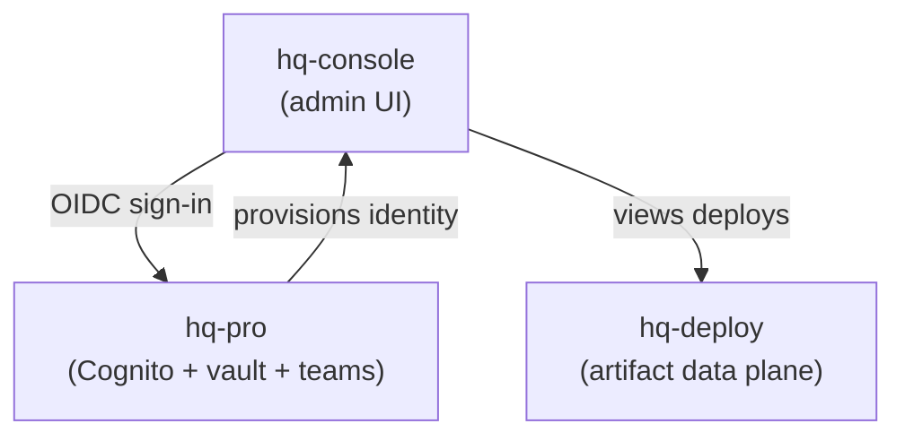

**hq-console** is the HQ admin surface: a Next.js web app where administrators manage HQ Cloud deployments, teams, Fleet Agents, and usage. It is deployed to Vercel (e.g. `hq.computer`).

## What it is

- A **Next.js 15 / React 19** application styled with Tailwind v4.
- Authenticated with **NextAuth v5** via OIDC against the shared AWS Cognito identity pool, which is also provisioned by [hq-pro](/hq/products/hq-pro/about/). The Console does **not** run its own user store.
- Uses AWS SDK v3 (Cognito, S3, Secrets Manager, STS) and recharts for usage visualizations.

## Who uses it

Administrators and team owners. The Console is the human-facing window into the cloud side of HQ: the things you do not manage from the CLI.

## Key surfaces

- **Deployments:** visibility into HQ web-artifact deploys managed by [hq-deploy](/hq/products/hq-deploy/introduction/).
- **Team:** membership and team administration backed by the [hq-pro](/hq/products/hq-pro/about/) team platform, including the invite-acceptance flow (`/invite/[token]` → `/api/invites/claim`).
- **Agents:** create and operate persistent [Fleet Agents](/hq/products/fleet-agents/) with managed runtimes, company access, communication channels, and an Owners panel for delegated ownership.
- **Personal Integrations:** link individual accounts, including a workspace-specific Slack connection that lets an agent recognize its owners reliably. See [Access and security](/hq/products/fleet-agents/access/).
- **Connections:** issue scoped, read-only credentials so external agents and services can read selected prefixes of your company vault. See [External Connections](/hq/products/capabilities/external-connections/).
- **Usage:** usage and activity charts.

## White-label branding (Enterprise)

Companies on the **Enterprise plan** can apply their own branding to the Console:

- **Company logo** — upload light- and dark-mode variants (SVG or PNG); the logo replaces the HQ wordmark in the sidebar for every member of the company. Uploads are validated and sanitized server-side.
- **Accent color** — choose from a curated palette of accents, each pre-validated for readable contrast in both light and dark modes.
- A **"powered by HQ" mark** always appears beneath the company logo. It is part of the product and cannot be removed or restyled.

Owners and admins manage branding from **Company settings → Branding**, with a live preview (including a light/dark toggle) before saving. Companies not on the Enterprise plan see a preview of the feature with an upgrade path; branding is enforced server-side by the plan entitlement. Removing the branding — or leaving the Enterprise plan — returns the Console to standard HQ appearance on the next load.

## How it relates to the rest of the ecosystem

```mermaid
graph TD
    console["hq-console<br/>(admin UI)"] -->|OIDC sign-in| pro["hq-pro<br/>(Cognito + vault + teams)"]
    console -->|views deploys| deploy["hq-deploy<br/>(artifact data plane)"]
    pro -->|provisions identity| console
```

The console is a **read/manage surface** over capabilities owned elsewhere: identity, vault, and teams live in [hq-pro](/hq/products/hq-pro/about/); artifact hosting lives in [hq-deploy](/hq/products/hq-deploy/introduction/). It composes them into one admin experience rather than implementing them itself.

## Operational notes

- Runs locally with `pnpm dev` (port 3400); built and started with `pnpm build` / `pnpm start`.
- Guarded by a CI gate plus a periodic production smoke check.
