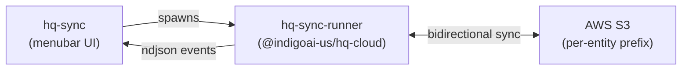
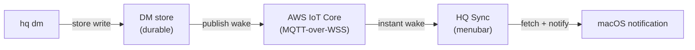

**hq-sync** is the HQ Sync menubar app: a native macOS menu-bar agent that keeps your local HQ directory synced with the cloud, without living in the terminal. It wraps the same sync engine the `hq` CLI uses behind a friendly GUI aimed at non-technical users.

## What it is

- A **Tauri 2** desktop app (small Rust backend + Svelte 5 UI), distributed as a signed/notarized macOS app.
- Identifier `ai.indigo.hq-sync-menubar`, productName "HQ Sync".
- A system-tray agent with per-workspace sync rows, real per-file progress, a Stop button, conflict resolution, new-file notifications, instant DM notifications, and Connect diagnostics.

## Who uses it / when

Use hq-sync when you want HQ kept in sync in the background without running `hq sync` commands by hand — especially on a workstation where a non-technical operator just wants a menubar toggle. Power users who live in the terminal can keep using the [`hq` CLI](/hq/products/hq-cli/) directly; both drive the same engine.

## How it works

hq-sync is a **GUI over the engine, not its own sync implementation**. It spawns the `hq-sync-runner` binary shipped by [`@indigoai-us/hq-cloud`](/hq/products/hq-cloud/), reads the ndjson sync events that runner emits, and renders them as live progress in the menubar. The actual bidirectional S3 transfer, journaling, and conflict detection all happen in the cloud engine.

> **Distinction:** "hq-sync" is the menubar **app**. The sync **engine** is `@indigoai-us/hq-cloud`, and the same engine is also invoked by `hq sync` from the CLI. The app does not contain its own sync logic.

## Instant DM delivery

HQ Sync also receives **direct messages** — sent with `hq dm` or the `/dm` command — and surfaces them as native macOS notifications, with one-click "Copy prompt" and "Open details" actions and an inline reply.

As of **0.3.0**, DMs arrive **near-instantly** (p95 under 3 seconds, end-to-end) instead of waiting on a polling interval. HQ Sync subscribes to a per-user topic on an AWS IoT Core (MQTT-over-WebSockets) real-time fabric; the moment a DM is stored, a lightweight wake event is published to the recipient's topic and the menubar fetches and shows it immediately.

Key properties:

- **Per-identity isolation** — each client connects with short-lived, scoped credentials and can only subscribe to its own DM topic; cross-user topics are denied at the broker.
- **No DM is ever lost** — the durable store is the source of truth and MQTT is only the wake signal. If the real-time connection is unavailable, delivery falls back to the existing periodic poll with no loss and no regression.
- **Nothing to configure** — the real-time path is automatic for signed-in users; DM notifications can be turned off in HQ Sync settings.

## Manage packages

HQ ships capabilities as **packs** (engineering, design, and more). From **Settings → Packages → Manage…**, HQ Sync opens a dedicated Packages window where you can browse, install, update, and uninstall packs without touching the terminal:

- **Installed** packs show their version, an "update available" badge, and a warning if any of their links are broken — each with **Update** and **Uninstall** actions.
- **Available** shows the curated pack catalog plus any registry packages you're entitled to, each with an **Install** action.
- Installs and updates stream live progress; uninstalls cleanly remove a pack's wiring and archive it.

Like everything else in HQ Sync, the window is a GUI over the `hq` CLI — it wraps the `hq packs` commands (see [hq-cli](/hq/products/hq-cli/)) so the CLI and the app share one implementation.

## Install & updates

hq-sync ships through GitHub Releases as a signed, notarized macOS DMG (minimum macOS 13.0). It auto-updates via a published `latest.json` manifest — once installed, new versions are offered automatically.

Releases are cut by pushing a `v*` git tag, which runs the sign/notarize/DMG workflow. The version is kept in lockstep across `package.json`, `src-tauri/Cargo.toml`, and `src-tauri/tauri.conf.json`.

## Related

- [hq-cloud](/hq/products/hq-cloud/) — the sync engine hq-sync drives
- [hq-cli](/hq/products/hq-cli/) — `hq sync` runs the same engine from the terminal
- [Cloud sync architecture](/hq/architecture/5-hq-cloud/) — engine internals
