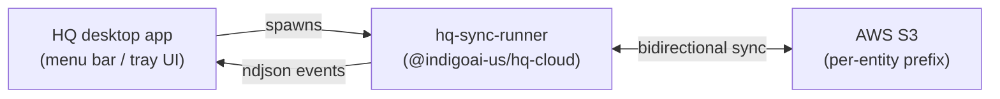
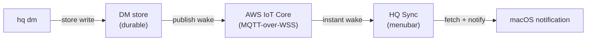

The **HQ desktop app** is one installer and sync app. On first launch it creates
your HQ workspace and guides you through setup. After onboarding, the same app
lives in the macOS menu bar or Windows system tray and keeps your local HQ
directory synced with the cloud.

## What it is

- A **Tauri 2** desktop app (small Rust backend + Svelte 5 UI), distributed for macOS and Windows.
- One download, version, and updater stream for installation and ongoing sync.
- A system-tray agent with per-workspace sync rows, real per-file progress, a Stop button, conflict resolution, new-file notifications, instant DM notifications, a notifications-first popover with full notification history, share reactions, and Connect diagnostics.

## Who uses it / when

Use the desktop app to install HQ and keep it synced in the background without
running `hq sync` commands by hand. Power users who live in the terminal can
keep using the [`hq` CLI](/hq/products/hq-cli/) directly; both drive the same
engine.

## First-run onboarding

Download HQ from [hqforwork.com/install](https://hqforwork.com/install), sign
in, choose a workspace location, and select **Install**. The final **HQ is
ready** screen offers **Open in Claude Code** and **Open in Codex**.

Selecting either tool completes onboarding, opens the workspace there, and
hands control to the compact sync popover. There are no additional desktop
onboarding screens to dismiss. If you prefer to open the workspace manually,
select **Finish**.

## How it works

The desktop app is a **GUI over the engine, not its own sync implementation**. It spawns the `hq-sync-runner` binary shipped by [`@indigoai-us/hq-cloud`](/hq/products/hq-cloud/), reads the ndjson sync events that runner emits, and renders them as live progress in the menu bar or system tray. The actual bidirectional S3 transfer, journaling, and conflict detection all happen in the cloud engine.

```mermaid
graph LR
    tray["HQ desktop app<br/>(menu bar / tray UI)"] -->|spawns| runner["hq-sync-runner<br/>(@indigoai-us/hq-cloud)"]
    runner <-->|bidirectional sync| s3["AWS S3<br/>(per-entity prefix)"]
    runner -->|ndjson events| tray
```

> **Distinction:** The HQ desktop app owns onboarding and the tray UI. The sync
> **engine** is `@indigoai-us/hq-cloud`, and the same engine is also invoked by
> `hq sync` from the CLI. The app does not contain its own sync logic.

## Instant DM delivery

HQ Sync also receives **direct messages** — sent with `hq dm` or the `/dm` command — and surfaces them as native macOS notifications, with one-click "Copy prompt" and "Open details" actions and an inline reply. "Open details" opens the full **two-way conversation thread** — your messages and theirs, in order — not just the single notification, so a DM reads as a conversation rather than a one-off alert.

As of **0.3.0**, DMs arrive **near-instantly** (p95 under 3 seconds, end-to-end) instead of waiting on a polling interval. HQ Sync subscribes to a per-user topic on an AWS IoT Core (MQTT-over-WebSockets) real-time fabric; the moment a DM is stored, a lightweight wake event is published to the recipient's topic and the menubar fetches and shows it immediately.

```mermaid
graph LR
    send["hq dm"] -->|store write| store["DM store<br/>(durable)"]
    store -->|publish wake| iot["AWS IoT Core<br/>(MQTT-over-WSS)"]
    iot -->|instant wake| tray["HQ Sync<br/>(menubar)"]
    tray -->|fetch + notify| notif["macOS notification"]
```

Key properties:

- **Per-identity isolation** — each client connects with short-lived, scoped credentials and can only subscribe to its own DM topic; cross-user topics are denied at the broker.
- **No DM is ever lost** — the durable store is the source of truth and MQTT is only the wake signal. If the real-time connection is unavailable, delivery falls back to the existing periodic poll with no loss and no regression.
- **Nothing to configure** — the real-time path is automatic for signed-in users; DM notifications can be turned off in HQ Sync settings.

## Manage packages

HQ ships capabilities as **packs** (engineering, design, and more). From **Settings → Packages → Manage…**, HQ Sync opens a dedicated Packages window where you can browse, install, update, and uninstall packs without touching the terminal:

- **Installed** packs show their version, an "update available" badge, and a warning if any of their links are broken — each with **Update** and **Uninstall** actions.
- **Available** shows the curated pack catalog plus any registry packages you're entitled to, each with an **Install** action.
- Installs and updates stream live progress; uninstalls cleanly remove a pack's wiring and archive it.

Like everything else in HQ Sync, the window is a GUI over the `hq` CLI — it wraps the `hq packs` commands (see [hq-cli](/hq/products/hq-cli/)) so the CLI and the app share one implementation.

## Notifications

Notifications in HQ Sync are normally transient — a DM banner or a new-file alert appears and then it's gone. As of **0.9.8**, notifications are the first thing you see: the menubar popover opens to a **Notifications** tab (with a **Workspaces** tab beside it for the sync rows), showing a compact, reverse-chronological feed with an unread badge and a "Mark all read" action. The desktop view gains a matching full-size **Notifications** page with the feed grouped by day. (This supersedes the bell-button Notifications window introduced in 0.6.0.)

The feed brings three notification types into one view:

- **Direct messages** you've received — click through to the full conversation thread and reply.
- **Files shared with you** — click through to the share details.
- **New files** synced to your drive — the files teammates added, attributed to whoever added them.

Direct messages and shared files show their full history (the server retains them). New-file history fills in across sessions as your `hq` CLI updates to the version that reports them — within a session, the current sync's new files always appear.

## Share reactions & messaging the sharer

When someone shares a file with you, the share isn't a dead-end alert (as of **0.9.8**):

- **React with an emoji** — share details and the notification feed carry the same reaction bar DMs use. Reactions are scoped to the share, visible to the sharer and every recipient, and update in near-real-time over the same instant-delivery fabric DMs use.
- **The sharer hears about it** — reacting to a share automatically sends the sharer a direct message, so a 👍 closes the loop without anyone composing anything.
- **Message the sharer** — a one-click action opens a DM conversation with the person who shared the file, deep-linked from the share itself.
- **Share history lives in Messages** — files a person shared with you appear inline in your DM thread with them as share cards, and conversation previews show "Shared a file," so shares and messages read as one conversation.

## Install & updates

The HQ desktop app ships through GitHub Releases as a signed, notarized macOS
DMG (minimum macOS 13.0) and a Windows installer. It auto-updates via a
published `latest.json` manifest — once installed, new versions are offered
automatically.

Releases are cut from the unified `hq-desktop-app` repository. Installation and
sync therefore always move forward on the same version and updater stream.

## Related

- [hq-cloud](/hq/products/hq-cloud/) — the sync engine hq-sync drives
- [hq-cli](/hq/products/hq-cli/) — `hq sync` runs the same engine from the terminal
- [Cloud sync architecture](/hq/architecture/5-hq-cloud/) — engine internals
