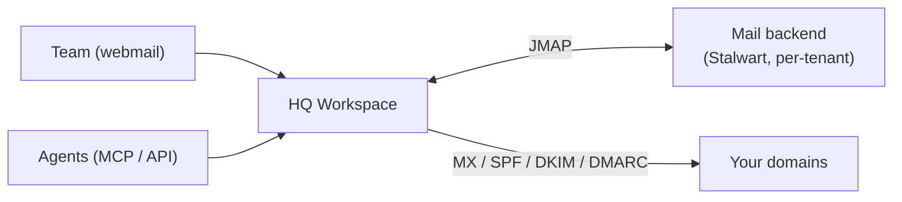

**HQ Workspace** is the owned email and calendar substrate of the HQ ecosystem — the mailbox HQ's agents live in. It's a cloud email platform (webmail, REST API, and a native MCP endpoint) built so that humans and agents work the same inbox, with the front end live at [workspace.hq.computer](https://workspace.hq.computer).

## What it is

- *"The agent-first email + calendar substrate for HQ by Indigo."*
- A cloud webmail app for your team plus an **agent API** and a **cloud MCP endpoint**, so agents send, read, and triage mail without screen-scraping a human client.
- Built on JMAP over a Stalwart mail backend, with per-tenant isolation, custom domains (MX/SPF/DKIM/DMARC auto-configured), and an open-source self-host path.

## Who uses it / when

- **Teams** who want a clean three-pane inbox with search, drafts, contacts, and signatures — provisioned in seconds, no Docker required.
- **Agents** that need a first-class mailbox: one API call to provision, then a cloud MCP endpoint to send and manage mail directly.
- **Self-hosters** who want to run the same stack from source.

The hosted product is at [workspace.hq.computer](https://workspace.hq.computer); the source ships as the `hq-work` / `hq-work-site` repos.

## What it does

- **Webmail** — three-pane inbox with keyboard shortcuts, search, compose/drafts, contacts, and signatures.
- **Agent API + MCP** — provision a workspace with one API call; agents talk to a cloud MCP endpoint to send and triage mail.
- **Domains + deliverability** — add custom domains with MX, SPF, DKIM, and DMARC auto-configured.
- **Tenant isolation** — every account is scoped to its org; agents only ever touch their own mailbox.

## Place in the HQ family

HQ Workspace is a member of the **HQ by Indigo** product family — the same family as [hq-cloud](/hq/products/hq-cloud/), [hq-sync](/hq/products/hq-sync/), and [hq-pro](/hq/products/hq-pro/about/). Where hq-cloud is the sync substrate and hq-pro is the identity/cloud substrate, **HQ Workspace is the communication substrate**: the email and calendar layer HQ's humans and agents share.

## Related

- [hq-pro](/hq/products/hq-pro/about/) — identity and cloud backing for HQ
- [hq-cloud](/hq/products/hq-cloud/) — the HQ sync engine
- [HQ in Chat](/hq-in-chat/) — the HQ MCP surface agents query
