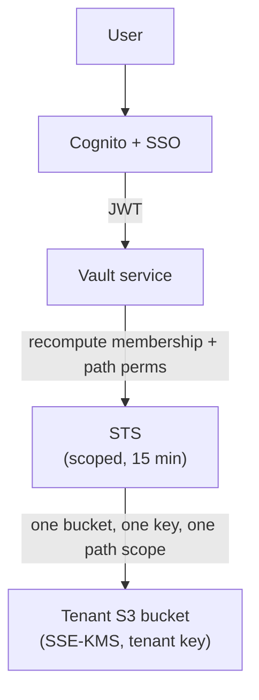

This page summarizes HQ's security architecture for security, IT, privacy, and procurement reviewers. It describes what is implemented today, draws a clear line between the local product and the cloud product, and states current limitations honestly. For the list of third parties that process customer data, see [Subprocessors](/hq/security/2-subprocessors/).

:::note[Where things run]
HQ has two layers. The **local layer** is the HQ directory and the desktop/CLI tools that run on your own machine. The **cloud layer** ([HQ Cloud](/hq/products/hq-cloud/) for personal sync and [HQ Pro](/hq/products/hq-pro/about/) for teams) is optional and stores synced content in AWS. Most of the controls below apply to the cloud layer; the local layer is governed by the [shared responsibility](#shared-responsibility) split.
:::

## Executive summary

HQ Cloud is hosted on AWS in the United States (`us-east-1`). The team product (HQ Pro) uses tenant-isolated storage: each customer organization receives a **dedicated S3 bucket and a dedicated AWS KMS key**, and access is brokered through **short-lived AWS STS sessions** that are recomputed per request and scoped to the tenant, the permitted paths, and the allowed operation.

Indigo does not use customer data to train models. HQ's own cloud-side AI features run on **AWS Bedrock** (Claude models hosted inside AWS), which does not train on or retain request data. The local agent tools (Claude Code, Cursor, Codex) run on your machine using **your own model-provider credentials** — that traffic goes from your machine to the provider you chose, and Indigo does not broker it.

Indigo is **not yet SOC 2 or ISO certified**. The product is designed to align with the SOC 2 Trust Services Criteria, and readiness work is in progress. Implemented controls and current limitations are listed below.

## Review at a glance

| Question | Answer |
|---|---|
| Where is customer data hosted? | AWS `us-east-1`, United States. |
| How are tenants separated? | HQ Pro: a separate S3 bucket and a separate KMS key per organization, plus per-request scoped STS credentials. HQ Cloud (personal): a single bucket with per-user prefix isolation and per-user scoped STS. |
| Is data encrypted at rest? | Yes. SSE-KMS (AES-256) with a tenant-specific, Indigo-managed KMS customer-managed key. |
| Is data encrypted in transit? | Yes. TLS is enforced; bucket policy denies non-TLS requests. |
| How do users authenticate? | AWS Cognito with Google Workspace OIDC SSO and GitHub federated sign-in. Desktop/CLI use OAuth2 Authorization Code with PKCE. |
| How is authorization enforced? | Organization roles plus path-scoped capabilities, translated into short-lived, narrowed AWS credential policies. |
| Is there audit logging? | Yes. CloudTrail data events on customer storage (with log-file validation) and an application audit trail for credential issuance and administrative actions. |
| Are prompts or outputs used for model training? | No. Indigo does not train on customer data. Cloud AI runs on AWS Bedrock, which does not train on API data. |
| Can Indigo sign a DPA? | Yes, on request. GDPR and CCPA/CPRA support is available. |
| Any certifications today? | Not yet. SOC 2 and ISO certifications have not been completed. |

## Deployment model

HQ is **local-first with optional cloud sync**. The HQ directory and the agent tooling run on the customer's own machine (macOS today; Windows support is in progress). HQ Cloud is an optional layer that syncs content to AWS so it is available across people and devices.

This matters for security review because the customer's endpoint is part of the trust boundary: local files, locally configured credentials, and locally run AI agents are governed by the customer's own machine and policies. The [shared responsibility](#shared-responsibility) section makes the split explicit.

## Tenant isolation

Tenant isolation is HQ's strongest control. The team vault (HQ Pro) does not rely only on an application-level tenant check in a shared store:

- Each organization receives a **separate S3 bucket** (`hq-vault-cmp-…`) and a **separate KMS key** (automatic annual rotation, deletion protection).
- The vault defaults to **deny-all**. Access is granted as narrow, time-bound **capabilities**, not broad credentials.
- Every request **recomputes** organization membership and path permissions before issuing credentials.
- Access uses **short-lived AWS STS sessions** — 15 minutes by default, capped at one hour — scoped to one tenant bucket, one tenant key, and the authorized path.
- Requests **fail closed**: if a safe, scoped policy cannot be represented, the session is issued a deny-all policy rather than a broader one.
- CI includes **blocking end-to-end tests** that attempt cross-tenant access and assert denial.

The personal tier (HQ Cloud) uses a single bucket with **per-user prefix isolation** (`users/{userId}/hq/`); every file operation is scoped to the authenticated user's prefix, and STS credentials are scoped to that prefix and expire after one hour.

## Identity and access management

HQ uses AWS Cognito for authentication and identity federation. **Google Workspace OIDC SSO** is the primary self-service path, and **GitHub federated sign-in** is supported for onboarding. Native password self-registration is not the intended path for teams.

Desktop and CLI authentication uses **OAuth2 Authorization Code with PKCE (S256)**, validates state, and uses a local loopback redirect. Access and ID tokens last **one hour**; refresh tokens last **30 days**. Desktop tokens are stored in the OS keychain where available, with a restricted local-file fallback otherwise.

Authorization combines **organization roles** with **path-scoped capabilities** (entitlement packs and ACLs). Customers can invite and remove members, assign roles, grant or revoke path access, and revoke sharing by removing a grant or letting a capability link expire.

Staff administrative access is restricted and logged; administrative and impersonation actions are recorded in the application audit trail. Customers' own identity-provider policy (MFA strength, conditional access, deprovisioning) remains part of the customer's posture.

## Encryption, sharing, and secrets

- **At rest** — customer content is encrypted with **SSE-KMS (AES-256)** using a tenant-specific, Indigo-managed KMS customer-managed key, with S3 bucket keys enabled.
- **In transit** — TLS is enforced. Bucket policy includes an explicit **deny** for non-TLS (`aws:SecureTransport: false`) requests. S3 Public Access Block is enabled and object versioning is on.
- **Share links** — [hq-share](/hq/products/capabilities/hq-share/) mints **single-use, time-limited capability tokens** encrypted with **AES-256-GCM**. Tokens are pinned to specific paths, capped at write permission (they cannot grant admin), and enforce single use via an atomic nonce claim. The default lifetime is 15 minutes.
- **Secrets** — [hq-secrets](/hq/products/capabilities/hq-secrets/) stores application and customer secrets in **AWS SSM Parameter Store (SecureString)** or **AWS Secrets Manager**. Secrets are fetched into a process environment and are not printed to the terminal or committed to source control.

## AI and model-provider use

HQ uses AI in two distinct places, and they have different data paths:

| Surface | Where it runs | Provider | Notes |
|---|---|---|---|
| Local agent work | On the customer's machine | The **customer's own** model-provider account (Claude Code, Cursor, Codex) | Indigo does not broker this. Traffic goes from the customer's machine to the provider they configured, under that provider's terms. |
| Cloud-side AI (HQ Pro) | Indigo's AWS backend | **AWS Bedrock** (Claude models hosted in AWS, `us-east-1`) | Powers features such as meeting-signal extraction and ontology synthesis. Bedrock does not train on or retain request data. |

Indigo does **not** train models on customer data. Model inputs are limited to the content submitted or referenced for the requested action. Customers decide what content to submit to AI features.

:::note[On "Anthropic"]
HQ's cloud-side AI uses **Claude models through AWS Bedrock**, so the data path stays inside AWS rather than going to Anthropic's own API. Anthropic is the model provider behind Bedrock; it is listed in [Subprocessors](/hq/security/2-subprocessors/) for clarity, with its no-training stance noted. Local agent traffic uses the customer's own provider account and is a customer-connected tool, not an Indigo subprocessor.
:::

## Infrastructure and network security

HQ Cloud runs on managed AWS services, defined as code with SST v3 and reviewed through version control:

- **Compute** — AWS Lambda behind Amazon API Gateway (HTTP API with a JWT authorizer); long-running workloads use Amazon ECS Fargate.
- **Storage** — Amazon S3 for customer content; Amazon DynamoDB for metadata, access-control, and audit tables (point-in-time recovery enabled).
- **Network** — a dedicated VPC with private subnets and **no NAT gateway**; AWS service access is routed through **VPC interface endpoints**. Databases are not publicly accessible.
- **Keys** — AWS KMS, one customer-managed key per tenant, with automatic annual rotation and deletion protection.

Internet-facing surfaces are limited to managed entry points (API Gateway, Cognito hosted sign-in, and static web delivery). HQ does not operate its own data centers; physical and environmental controls are inherited from AWS.

## Application security and SDLC

Development uses Git with reviewed pull requests, environment separation, and CI gates: type-checking, linting, automated tests, and **blocking cross-tenant isolation end-to-end tests**. Dependencies are pinned with committed lockfiles and frozen installs in CI.

Desktop applications (the [HQ Installer](/hq/products/hq-pro/overview/) and the [HQ Sync](/hq/products/hq-sync/) menubar app) are **code-signed with an Apple Developer ID certificate, notarized by Apple, and distributed through cryptographically signed updates** (the updater verifies a minisign signature before applying an update).

HQ has **not yet completed an independent third-party penetration test**. Internal security review and adversarial testing are used while an external assessment is planned.

## Monitoring, audit, and investigation

- **CloudTrail** data events are enabled on customer storage buckets, with multi-region coverage and **log-file validation** for tamper evidence.
- An **application audit trail** (DynamoDB) records security-relevant events such as credential issuance, the requesting identity and source IP, the paths and operations involved, and administrative actions.
- **CloudWatch** is used for application logs, metrics, and alarms.
- **Sentry** is used for error and performance monitoring, with authentication tokens and local filesystem paths scrubbed before transmission; it is not intended to receive customer content.

## Compliance and privacy

Indigo does not currently claim SOC 2 or ISO certification. HQ controls are designed to align with the SOC 2 Trust Services Criteria for Security, Availability, and Confidentiality, and readiness work is in progress.

GDPR and CCPA/CPRA support is available through data-handling practices, data-subject-request support, and a Data Processing Addendum (with Standard Contractual Clauses where needed). **EU or other non-US data residency is not currently offered.** Export and deletion are available on request.

## Shared responsibility

| Indigo secures | The customer secures |
|---|---|
| Tenant isolation, encryption, platform authentication and authorization, infrastructure and application security, backups, incident response, and subprocessor management. | Their identity-provider policy and MFA enforcement, member and role assignment, what data is synced or shared, credentials granted to local agents, endpoint security, and oversight of AI agent actions. |

## Current limitations

State these plainly during review:

- No SOC 2 or ISO certification has been completed yet.
- No independent third-party penetration test has been completed yet.
- HQ Cloud runs in a **single AWS region** with no automated cross-region failover; formal RPO/RTO targets and tested restore drills are being finalized.
- **Native in-platform MFA is not available**; MFA is enforced through the customer's identity provider.
- **Refresh-token rotation is not yet enabled.**
- Customer-owned keys (BYOK) and end-to-end (zero-knowledge) encryption are not offered; tenant keys are Indigo-managed in AWS KMS.
- Automated dependency-vulnerability scanning and SBOM generation are planned but not yet fully implemented.
- Some internal administrative functions retain broader permissions than the steady-state customer data path; they are restricted and audited.

## Detailed topics

This overview is the summary. Deeper, reviewer-oriented detail lives in the rest of this section:

- [Tenant Isolation](/hq/security/3-tenant-isolation/) — per-company bucket + key, scoped STS, fail-closed
- [Data Security & Encryption](/hq/security/4-data-security-encryption/) — classification, keys, retention, deletion
- [Identity & Access Management](/hq/security/5-identity-access-management/) — SSO, PKCE, tokens, RBAC, staff access
- [Infrastructure & Network Security](/hq/security/6-infrastructure-network-security/) — AWS region, VPC, IaC, secrets
- [Application Security & SDLC](/hq/security/7-application-security-sdlc/) — CI gates, dependencies, signed builds
- [Shared Responsibility](/hq/security/8-shared-responsibility/) — what Indigo secures vs. the customer
- [Subprocessors](/hq/security/2-subprocessors/) — third parties that process customer data
- [Business Continuity & Incident Response](/hq/security/9-business-continuity-incident-response/) — backups, recovery, breach notification
- [Compliance Roadmap](/hq/security/10-compliance-roadmap/) — SOC 2 / ISO / GDPR / CCPA status
- [Vulnerability Disclosure](/hq/security/11-vulnerability-disclosure/) — how to report, scope, safe harbor
- [CAIQ Questionnaire](/hq/security/12-caiq-questionnaire/) — pre-filled cloud-control answers

## Reporting and contact

Security questions, documentation requests, vulnerability reports, and privacy requests go to **security@getindigo.ai**. For sensitive vulnerability details, request an encrypted channel in your first message.
