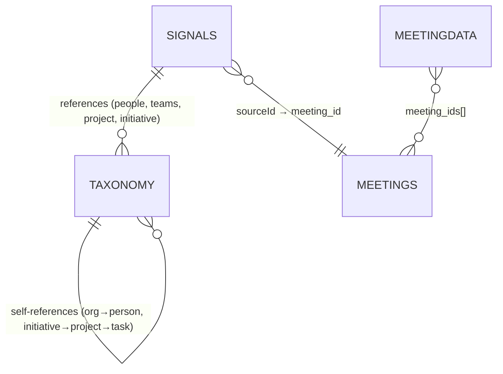

import { Aside, Tabs, TabItem } from "@astrojs/starlight/components";

The MCP server exposes 4 MongoDB collections. Each collection is tenant-isolated — queries are automatically filtered to your account.

## Collections overview

| Collection | Description | Key use |
|------------|-------------|---------|
| `signals` | Decisions, actions, accomplishments, key facts extracted from meetings | Find what was decided, who owns what, what happened |
| `meetings` | Meeting metadata — scheduling, participants, status, recordings | Browse past/upcoming meetings, search by title or attendee |
| `meetingdata` | Processed transcripts and LLM-generated analysis | Access raw meeting intelligence and AI summaries |
| `taxonomy` | Organizational entities — people, teams, projects, initiatives | Resolve references, understand organizational context |

## Relationships



---

## Signals

Extracted insights from meetings. Each signal is a discrete piece of information with a type, content, citation, and optional taxonomy links.

### Signal types

<Tabs>
  <TabItem label="decision">
    A choice or determination made during discussion.

    | Field | Type | Description |
    |-------|------|-------------|
    | data.title | String | Brief description of the decision |
    | data.rationale | String | Reasoning behind it |
    | data.owner | String | Person responsible |
    | data.impactLevel | String | `high`, `medium`, or `low` |
  </TabItem>
  <TabItem label="action">
    A task or commitment to do something.

    | Field | Type | Description |
    |-------|------|-------------|
    | data.title | String | Description of the action item |
    | data.assignee | String | Person assigned |
    | data.dueDate | Date | Target completion date |
    | data.status | String | `pending`, `in_progress`, or `completed` |
    | data.priority | String | `high`, `medium`, or `low` |
  </TabItem>
  <TabItem label="accomplishment">
    A completed achievement or milestone.

    | Field | Type | Description |
    |-------|------|-------------|
    | data.title | String | What was accomplished |
    | data.completedBy | String | Person who completed it |
    | data.completedAt | Date | When it was completed |
    | data.impact | String | Description of the impact |
  </TabItem>
  <TabItem label="key_fact">
    Important information or context.

    | Field | Type | Description |
    |-------|------|-------------|
    | data.title | String | Summary of the fact |
    | data.details | String | Detailed information |
    | data.category | String | Categorization |
    | data.confidence | Number | Confidence score (0.0 to 1.0) |
  </TabItem>
</Tabs>

### Core fields

| Field | Type | Description |
|-------|------|-------------|
| _id | ObjectId | Unique identifier |
| insightType | String | `decision`, `action`, `accomplishment`, or `key_fact` |
| data | Object | Type-specific content (see tabs above) |
| createdAt | Date | When the signal was created |
| updatedAt | Date | Last modification |

### Citation

Every signal includes a citation linking back to its source:

| Field | Type | Description |
|-------|------|-------------|
| citation.quote | String | Exact quoted text from the source |
| citation.surroundingContext | String | Additional context around the quote |
| citation.speaker | String | Who said it |
| citation.sourceLocation.startTime | Number | Start timestamp in seconds (audio/video) |
| citation.sourceLocation.endTime | Number | End timestamp in seconds |

### Source metadata

| Field | Type | Description |
|-------|------|-------------|
| sourceChannel | String | Platform: `zoom`, `google_meet`, `slack`, `teams` |
| sourceId | String | Source document ID (e.g., meeting ID) |
| timestamp | Date | When the source event occurred |
| participants | String[] | Participant names from the source |

### Taxonomy references

Signals can link to organizational entities for context:

| Field | Type | Description |
|-------|------|-------------|
| people | ObjectId[] | People mentioned or involved |
| teams | ObjectId[] | Associated teams |
| initiative | ObjectId | Parent initiative |
| project | ObjectId | Associated project |
| task | ObjectId | Specific task |

---

## Meetings

Meeting metadata including scheduling, participants, recording status, and processing state.

### Core fields

| Field | Type | Description |
|-------|------|-------------|
| _id | ObjectId | Unique identifier |
| meeting_id | String | External meeting identifier (from calendar) |
| meeting_title | String | Display title |
| meeting_description | String | Description or agenda |
| meeting_url | String | Join URL |
| start_time | Date | Scheduled start (ISO 8601) |
| end_time | Date | Scheduled end (ISO 8601) |
| status | String | Current status (see below) |
| summary | String | AI-generated meeting summary |
| transcript | String | Full text transcript |
| recording_file | String | URL or path to recording |
| bot_enabled | Boolean | Whether recording bot is enabled |

### Status values

| Status | Description |
|--------|-------------|
| `scheduled` | Not yet started |
| `in-progress` | Currently active |
| `processing` | Recording/transcript being processed |
| `completed` | Finished, all processing complete |
| `failed` | Processing or recording failed |
| `kicked` | Bot was removed from meeting |
| `denied` | Bot was denied entry |
| `cancelled` | Meeting was cancelled |

### Participants

Each meeting has a `participants` array:

| Field | Type | Description |
|-------|------|-------------|
| email | String | Participant email |
| organizer | Boolean | Whether they organized the meeting |
| self | Boolean | Whether this is the authenticated user |
| responseStatus | String | `accepted`, `declined`, `tentative`, or `needsAction` |

---

## Meeting Data

Processed transcripts and LLM-generated analysis. A single document can serve multiple meetings.

| Field | Type | Description |
|-------|------|-------------|
| _id | ObjectId | Unique identifier |
| meeting_ids | ObjectId[] | Associated meeting IDs |
| meeting_url | String | Meeting URL |
| llm_response | Object | AI-generated analysis (flexible structure) |
| recall_bot_id | String | Recording bot identifier |
| createdAt | Date | When processed |

The `llm_response` field contains AI-generated analysis and may include meeting summaries, key points, action items, topic extraction, and sentiment analysis. Structure varies by processing configuration.

---

## Taxonomy

Organizational entities that signals reference. Used for context resolution and categorization.

### Entity types

<Tabs>
  <TabItem label="person">
    | Field | Type | Description |
    |-------|------|-------------|
    | email | String | Primary email |
    | role | String | Job title |
    | department | String | Department name |
    | organization | ObjectId | Parent organization |
  </TabItem>
  <TabItem label="team">
    | Field | Type | Description |
    |-------|------|-------------|
    | members | ObjectId[] | References to person entities |
  </TabItem>
  <TabItem label="organization">
    | Field | Type | Description |
    |-------|------|-------------|
    | domain | String | Primary domain (e.g., `acme.com`) |
    | organizationType | String | `internal`, `customer`, `prospect`, or `vendor` |
  </TabItem>
  <TabItem label="initiative / project / task">
    | Field | Type | Description |
    |-------|------|-------------|
    | initiative | ObjectId | Parent initiative (for projects) |
    | project | ObjectId | Parent project (for tasks) |
    | status | String | Task status: `pending`, `in_progress`, `completed` |
    | startDate | Date | Start date (tasks) |
    | endDate | Date | Due date (tasks) |
  </TabItem>
</Tabs>

### Common fields (all types)

| Field | Type | Description |
|-------|------|-------------|
| _id | ObjectId | Unique identifier |
| type | String | `person`, `team`, `organization`, `initiative`, `project`, or `task` |
| name | String | Human-readable name |
| description | String | Optional description |
| externalReferences | Object | Links to external systems (Salesforce, HubSpot, Jira, Slack) |
| createdAt | Date | Created timestamp |
| updatedAt | Date | Last modified |

### External references

The `externalReferences` field links taxonomy entities to external systems:

```javascript
{
  "salesforce": { "id": "0015000000ABC123", "type": "Account" },
  "hubspot": { "id": "12345678", "portalId": "987654" },
  "jira": { "key": "PROJ-123" },
  "slack": { "channelId": "C0123456789" }
}
```

---

## Access control

<Aside type="tip">
You don't need to worry about tenancy filters. The MCP server injects them automatically — every query is scoped to your account.
</Aside>

Signals use OR-based access: your user ID in `userIds` OR your org ID in `companyIds`. Meetings use AND-based access: both `user_id` and `company_id` must match. The MCP server handles this transparently.
