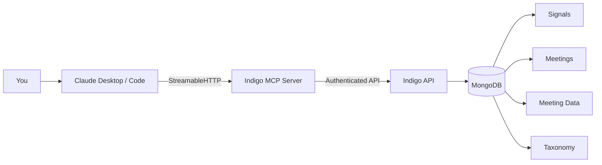

import { Card, CardGrid, Aside } from "@astrojs/starlight/components";

The Indigo MCP server exposes your meeting intelligence — signals, meetings, transcripts, and organizational taxonomy — through the [Model Context Protocol](https://modelcontextprotocol.io). Connect it to Claude and query your data with natural language.

## How it works



The MCP server acts as a bridge between your AI client and Indigo's data layer. Queries are authenticated with your Indigo credentials and automatically scoped to your account — you only see your own data.

## What's exposed

<CardGrid>
  <Card title="4 collections" icon="list-format">
    Signals, meetings, meeting data, and taxonomy — each queryable with filters, projections, sorting, and pagination.
  </Card>
  <Card title="4 tools" icon="setting">
    `query_collection`, `aggregate_collection`, `list_collections`, and `collection_info` for full data access.
  </Card>
  <Card title="Real-time data" icon="rocket">
    Every query hits live data. No caching, no stale results. New signals appear immediately after meetings.
  </Card>
  <Card title="Multi-tenant isolation" icon="approve-check">
    Tenancy filters are injected automatically. Your queries can never access another user's data.
  </Card>
</CardGrid>

## Supported clients

| Client | Transport | Status |
|--------|-----------|--------|
| Claude Desktop | StreamableHTTP | Supported |
| Claude Code | StreamableHTTP | Supported |
| Any MCP client | StreamableHTTP | Compatible |

## Setup

Run the one-command setup from the Indigo CLI:

```bash
indigo setup mcp
```

This authenticates with Indigo, generates the MCP server configuration, and writes it to your Claude Desktop config file. See the [full setup guide](/cli/commands/mcp/) for details.

<Aside type="note">
Requires Indigo CLI v0.2 or later. Run `indigo --version` to check.
</Aside>

## Next steps

<CardGrid>
  <Card title="Data model" icon="right-arrow">
    Understand the 4 collections and their schemas.
    [Collections](/mcp/collections/)
  </Card>
  <Card title="Available tools" icon="right-arrow">
    Reference for query and aggregation tools.
    [Tools](/mcp/tools/)
  </Card>
  <Card title="Use cases" icon="right-arrow">
    Practical prompts for common workflows.
    [Use cases](/mcp/use-cases/)
  </Card>
</CardGrid>
