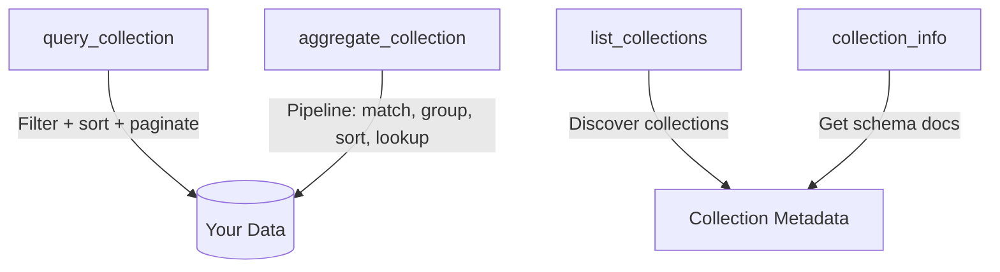

import { Aside } from "@astrojs/starlight/components";

The Indigo MCP server exposes 4 tools. Claude (or any MCP client) calls these tools automatically when you ask questions about your data.

## Tool overview



---

## query_collection

Query any collection with filters, projections, sorting, and pagination. This is the primary tool for most data access.

### Parameters

| Parameter | Type | Required | Default | Description |
|-----------|------|----------|---------|-------------|
| collection | String | Yes | — | `signals`, `meetings`, `meetingdata`, or `taxonomy` |
| filter | Object | No | `{}` | MongoDB filter conditions |
| projection | Object | No | all fields | Fields to include (1) or exclude (0) |
| sort | Object | No | — | Sort order: 1 ascending, -1 descending |
| limit | Number | No | 20 | Max documents to return (1–100) |

### Example

Find pending action items, newest first:

```javascript
{
  collection: "signals",
  filter: {
    insightType: "action",
    "data.status": "pending"
  },
  sort: { createdAt: -1 },
  limit: 10
}
```

---

## aggregate_collection

Run a MongoDB aggregation pipeline for complex analytics — grouping, counting, cross-collection lookups, and computed fields. Tenancy filters are injected automatically.

### Parameters

| Parameter | Type | Required | Description |
|-----------|------|----------|-------------|
| collection | String | Yes | `signals`, `meetings`, `meetingdata`, or `taxonomy` |
| pipeline | Object[] | Yes | Array of aggregation stages |

### Supported stages

| Stage | Description |
|-------|-------------|
| `$match` | Filter documents |
| `$group` | Group by field(s) and compute aggregates |
| `$sort` | Sort results |
| `$project` | Reshape documents, include/exclude fields |
| `$lookup` | Join with another collection |
| `$unwind` | Flatten arrays into separate documents |
| `$limit` | Cap result count |
| `$skip` | Skip N documents |
| `$count` | Count matching documents |
| `$addFields` | Add computed fields |

### Example

Count signals by type from the last 30 days:

```javascript
{
  collection: "signals",
  pipeline: [
    {
      $match: {
        createdAt: {
          $gte: { $date: "2025-01-01T00:00:00Z" }
        }
      }
    },
    {
      $group: {
        _id: "$insightType",
        count: { $sum: 1 }
      }
    },
    { $sort: { count: -1 } }
  ]
}
```

---

## list_collections

Returns metadata about all available collections, including document counts visible to your account.

### Parameters

None.

### Response

```javascript
[
  { name: "signals", description: "...", count: 342 },
  { name: "meetings", description: "...", count: 87 },
  { name: "meetingdata", description: "...", count: 64 },
  { name: "taxonomy", description: "...", count: 156 }
]
```

---

## collection_info

Returns detailed schema documentation for a specific collection — field types, relationships, and example queries.

### Parameters

| Parameter | Type | Required | Description |
|-----------|------|----------|-------------|
| collection | String | Yes | `signals`, `meetings`, `meetingdata`, or `taxonomy` |

### Response

Returns a markdown-formatted schema document including field definitions, type-specific structures, access control patterns, and example queries. This is what Claude uses to understand how to query your data.

---

## When to use which tool

| Scenario | Tool |
|----------|------|
| Find specific records by criteria | `query_collection` |
| Count, group, or aggregate data | `aggregate_collection` |
| Join data across collections | `aggregate_collection` with `$lookup` |
| Simple list with filters and sorting | `query_collection` |
| Check what data is available | `list_collections` |
| Understand a collection's schema | `collection_info` |

<Aside type="tip">
You don't need to specify which tool to use. When you ask Claude a question, it automatically picks the right tool based on what you're asking.
</Aside>
