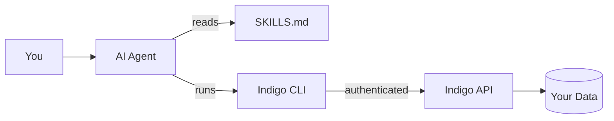

import { Card, CardGrid, Aside, Steps, Tabs, TabItem } from "@astrojs/starlight/components";

Add a single reference file — `SKILLS.md` — to your AI agent's context and it learns every Indigo CLI command, output format, error code, and multi-step workflow. Your agent can then authenticate, search signals, browse meetings, and run setup — all through natural language.

## How it works



Your agent reads SKILLS.md once to understand the CLI, then runs `indigo` commands in a shell on your behalf. Commands are authenticated with your credentials and return structured JSON that your agent parses automatically.

## Skills vs MCP

Indigo offers two ways to connect AI agents to your data. You can use either or both.

| | Skills | MCP |
|--|--------|-----|
| How it works | Agent runs CLI commands in a shell | Agent calls query tools directly |
| Best for | Automation, setup, account ops, scripting | Data queries, analytics, exploration |
| Requires | Any agent with shell access | MCP-compatible client (Claude Desktop/Code) |
| Data access | CLI output (JSON or human-readable) | Direct database queries with filters |
| Setup | Add SKILLS.md to agent context | Run `indigo setup mcp` |

<Aside type="tip">
Most setups benefit from both. Use Skills for authentication and configuration, then MCP for ongoing data queries. See [MCP Server](/mcp/overview/) for setup.
</Aside>

## Setup

<Steps>

1. **Get the SKILLS.md file**

   SKILLS.md is a single markdown file (~1,100 lines) that documents every Indigo CLI command — flags, output schemas, exit codes, and workflows.

   <Tabs>
     <TabItem label="Copy from repo">
       If you have access to the indigo-nx repository, copy SKILLS.md from the project root:

       ```bash
       cp /path/to/indigo-nx/SKILLS.md ./SKILLS.md
       ```
     </TabItem>
     <TabItem label="Download from GitHub">
       Download the file directly:

       ```bash
       curl -o SKILLS.md https://raw.githubusercontent.com/indigoai-us/indigo-nx/main/SKILLS.md
       ```
     </TabItem>
   </Tabs>

2. **Add SKILLS.md to your agent**

   <Tabs>
     <TabItem label="Claude Desktop">
       Add SKILLS.md as a **Project Knowledge** file:

       1. Open Claude Desktop and create or open a project
       2. Click the project settings icon
       3. Under **Project Knowledge**, click **Add file**
       4. Select your SKILLS.md file

       Claude will include the file in every conversation within that project.
     </TabItem>
     <TabItem label="Claude Code">
       Add SKILLS.md to your project's `.claude/` directory or reference it in CLAUDE.md:

       ```bash
       # Option A: Copy into .claude directory
       mkdir -p .claude
       cp SKILLS.md .claude/SKILLS.md

       # Option B: Reference in CLAUDE.md
       echo "See SKILLS.md for Indigo CLI capabilities." >> CLAUDE.md
       ```
     </TabItem>
     <TabItem label="Cursor">
       Add SKILLS.md to your project docs or `.cursorrules`:

       ```bash
       mkdir -p .cursor/docs
       cp SKILLS.md .cursor/docs/SKILLS.md
       ```
     </TabItem>
     <TabItem label="Windsurf">
       Add SKILLS.md to your Windsurf rules:

       ```bash
       cp SKILLS.md .windsurfrules/SKILLS.md
       ```
     </TabItem>
     <TabItem label="Other agents">
       Copy SKILLS.md into wherever your agent reads context files — a docs folder, rules file, or project settings. If your agent supports a system prompt field, you can paste the contents directly.
     </TabItem>
   </Tabs>

3. **Verify it works**

   Ask your agent:

   ```
   Check my Indigo auth status.
   ```

   Your agent should run `indigo auth status --json` and report whether you're authenticated. If it doesn't recognize the command, check that SKILLS.md is loaded — some agents need a restart to pick up new files.

</Steps>

## What your agent can do

Once SKILLS.md is loaded, your agent understands every command group in the Indigo CLI.

### Authentication

Your agent can check auth status, guide you through login, and detect expired tokens.

**Try asking:**

```
Am I logged into Indigo?
```
```
Help me log in to Indigo.
```

For command details, see [indigo auth](/cli/commands/auth/).

---

### Signals & insights

Your agent can search, filter, and retrieve meeting signals — decisions, actions, accomplishments, and key facts.

**Try asking:**

```
Find all action items from last week.
```
```
What decisions were made about the product launch?
```
```
Show me key facts from yesterday's meetings.
```

| Signal type | Description |
|-------------|-------------|
| `decision` | A decision made during a meeting |
| `action` | An action item assigned to a person or team |
| `accomplishment` | A completed milestone or achievement |
| `key_fact` | An important piece of information shared |

For command details, see [indigo signals](/cli/commands/signals/).

---

### Meetings

Your agent can browse your calendar, search by title or participant, and view meeting details with summaries.

**Try asking:**

```
What meetings do I have today?
```
```
Find meetings with Sarah from last week.
```
```
Show me the summary of the product planning meeting.
```

<Aside type="note">
Meeting commands require a connected Google Calendar. Your agent will guide you through `indigo setup calendar` if needed.
</Aside>

For command details, see [indigo meetings](/cli/commands/meetings/).

---

### Setup & configuration

Your agent can run the setup wizard, check configuration status, connect your calendar, manage API keys, and configure MCP.

**Try asking:**

```
Check my Indigo setup status.
```
```
Help me connect my Google Calendar.
```
```
Set up MCP for Claude Desktop.
```

For command details, see [indigo config](/cli/commands/config/).

---

### Multi-step workflows

Your agent chains commands together for complex tasks — the real power of Skills.

**Daily briefing:**
```
Prepare me for today's meetings.
```

**Action item review:**
```
What action items are pending from this week?
```

**Meeting intelligence:**
```
Search across my meetings and signals for anything about Q2 planning.
```

**First-time setup:**
```
Help me set up Indigo from scratch.
```

**Weekly recap:**
```
Give me a summary of what happened in my meetings this week.
```

## What Skills don't cover

<Aside type="caution">
Skills run CLI commands in a shell. For complex data queries, aggregations, or cross-collection analysis, the [MCP server](/mcp/overview/) gives your agent direct database access and is significantly more efficient.
</Aside>

## Next steps

<CardGrid>
  <Card title="CLI commands" icon="setting">
    Full reference for every Indigo CLI command.
    [CLI overview](/cli/overview/)
  </Card>
  <Card title="MCP server" icon="rocket">
    Give your agent direct database access as a complement to Skills.
    [MCP overview](/mcp/overview/)
  </Card>
  <Card title="CLI automation" icon="right-arrow">
    Scripting patterns, exit codes, and CI/CD integration.
    [Automation](/cli/automation/)
  </Card>
  <Card title="MCP use cases" icon="puzzle">
    Practical prompts for data queries via MCP.
    [Use cases](/mcp/use-cases/)
  </Card>
</CardGrid>
